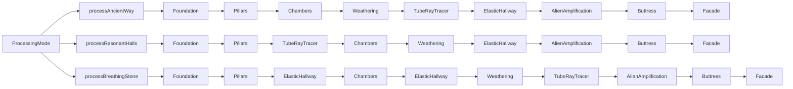
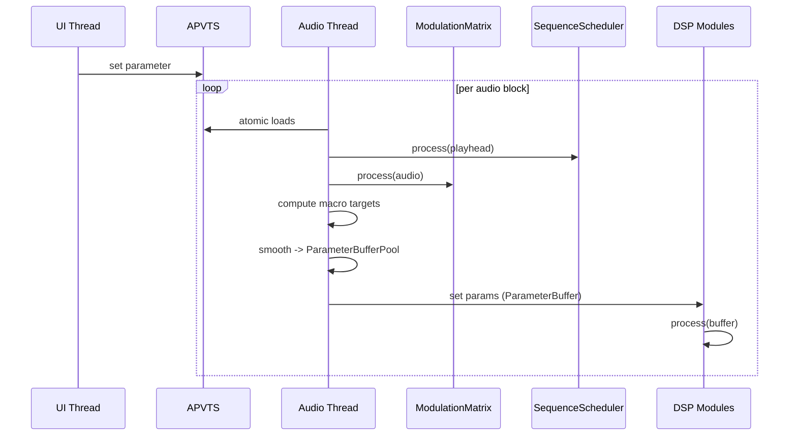

# Architecture Review

Date: 2026-01-09
Status: Draft (code review only, no builds/tests run)

## Scope
Reviewed core DSP and processor paths:
- plugin/PluginProcessor.{h,cpp}
- dsp/DspRoutingGraph.{h,cpp}
- dsp/ParameterBuffers.h
- dsp/DspModules.{h,cpp}
- dsp/Chambers.{h,cpp}
- dsp/TubeRayTracer.{h,cpp}
- dsp/ElasticHallway.{h,cpp}
- dsp/AlienAmplification.{h,cpp}
- dsp/ModulationMatrix.{h,cpp}
- dsp/SequenceScheduler.{h,cpp}
- dsp/MemoryEchoes.{h,cpp}
- tests/ReverbDspTest.cpp

## System Overview
Monument Reverb is a modular JUCE plugin with a single audio processor that:
- reads APVTS parameters atomically,
- blends macro targets and modulation overrides,
- smooths critical parameters per sample into a fixed buffer pool,
- forwards parameters into a routing graph and module chain,
- mixes dry/wet output and applies mode transitions.

### High-Level Data Flow
```mermaid
graph TD
  subgraph Host
    AudioThread[Host Audio Thread]
    MessageThread[Host Message/UI Thread]
  end

  subgraph Processor
    APVTS[APVTS]
    Processor[MonumentAudioProcessor]
    ParamCache[ParameterCache + SmoothedValue]
    ParamBuffers[ParameterBufferPool]
    ModMatrix[ModulationMatrix]
    Sequence[SequenceScheduler]
    Routing[DspRoutingGraph]
    Memory[MemoryEchoes]
  end

  MessageThread -->|param writes| APVTS
  AudioThread -->|processBlock| Processor
  Processor -->|atomic loads| APVTS
  ModMatrix -->|mod offsets| ParamCache
  Sequence -->|timeline overrides| ParamCache
  ParamCache -->|smoothed buffers| ParamBuffers
  ParamBuffers -->|set params| Routing
  Routing -->|process audio| AudioThread
  Memory -. optional .-> Processor
```

### DSP Module Topology (Current Processing Modes)
ProcessingMode selects a fixed chain (AncientWay, ResonantHalls, BreathingStone)
implemented inside DspRoutingGraph. These paths are distinct from the graph's
preset-based process() entry point.



### Parameter and Modulation Flow


## Module Summary (Responsibilities)
- Foundation: input gain + DC blocking.
- Pillars: early reflections via multi-tap delays with dynamic layout.
- Chambers: 8-line FDN reverb core with diffusion, damping, freeze.
- Weathering: LFO-based modulation/delay drift layer.
- TubeRayTracer: metallic tube network coloration via modal filtering.
- ElasticHallway: deformable room modes with pressure tracking.
- AlienAmplification: spectral rotation + resonant peak + absorption drift.
- Buttress: drive/limiting safety stage.
- Facade: air EQ, width, output gain, optional 3D panning.

## Issues Found (with Potential Solutions)

### AR-01: ParameterBuffer constant copies can dangle (Critical)
Description:
ParameterBuffer stores a pointer to member storage for constants. Copying a
temporary constant ParameterBuffer (common in tests) leaves the destination
pointing to freed storage.
Evidence:
- dsp/ParameterBuffers.h
- tests/ReverbDspTest.cpp
Impact:
Non-deterministic parameter values, possible NaNs, and flaky tests.
Potential solutions:
- Implement custom copy/move that repoints data to the destination's
  constantStorage when isPerSample is false.
- Provide a static factory (makeConstant) and avoid copying temporaries.
- Add a regression test that passes a temporary constant buffer.

### AR-02: ParameterBufferPool hard cap can overflow in release builds (Critical)
Description:
ParameterBufferPool is capped at 2048 samples with a debug-only assert; larger
host block sizes will overflow buffers.
Evidence:
- dsp/ParameterBuffers.h
- plugin/PluginProcessor.cpp
Impact:
Out-of-bounds writes and audio thread crashes in hosts with large blocks.
Potential solutions:
- Clamp or chunk processing when numSamples > kMaxSamples.
- Allocate a fallback heap buffer sized to numSamples.
- Increase kMaxSamples to the maximum supported block size and enforce via
  prepareToPlay constraints.

### AR-03: Routing graph semantics do not match connection sources (High)
Description:
DspRoutingGraph::process ignores conn.source and uses the dry buffer as the
parallel source. Presets such as ParallelWorlds do not actually branch from
Pillars as defined.
Evidence:
- dsp/DspRoutingGraph.cpp
Impact:
Preset definitions do not reflect audible routing intent.
Potential solutions:
- Store per-module output buffers and use conn.source to select input.
- Implement a real graph evaluation (topological sort) with explicit
  intermediate buffers.

### AR-04: ProcessingMode crossfade does not fade out previous mode (High)
Description:
The mode transition sets the gain target to 0 then immediately to 1 in the same
block and only scales the new mode output. There is no true crossfade or
pre-switch fade-out.
Evidence:
- plugin/PluginProcessor.cpp
Impact:
Clicks or sudden tonal jumps when changing modes.
Potential solutions:
- Process old and new mode buffers and crossfade over N samples.
- Or fade out over N blocks, switch when gain reaches 0, then fade in.

### AR-05: Audio-thread allocations in physical modeling modules (High)
Description:
Several modules allocate or rebuild coefficients per block.
Evidence:
- TubeRayTracer: vector creation and IIR coefficient creation in process path
- ElasticHallway: makeBandPass per block
- AlienAmplification: makeAllPass per block, makeLowPass per block
Impact:
RT glitches in hosts, especially with small buffers or parameter automation.
Potential solutions:
- Precompute coefficient banks and swap atomically.
- Use filter types that update coefficients without heap allocation.
- Move coefficient updates to the message thread or a lock-free worker.

### AR-06: SequenceScheduler is not thread-safe for live edits (High)
Description:
currentSequence (vector of keyframes) is updated directly; process() reads it
without a lock-free snapshot.
Evidence:
- dsp/SequenceScheduler.cpp
Impact:
Potential data races and undefined behavior if UI edits during playback.
Potential solutions:
- Use a double-buffered sequence snapshot like ModulationMatrix.
- Restrict edits to stop playback or use a lock-free queue of edits.

### AR-07: dryBuffer.makeCopyOf may allocate on the audio thread (Medium)
Description:
makeCopyOf can resize if the incoming block size differs from the buffer size
set in prepare, causing allocations.
Evidence:
- dsp/DspRoutingGraph.cpp
Impact:
Potential RT glitches if hosts change block size during playback.
Potential solutions:
- Replace makeCopyOf with copyFrom into a preallocated buffer.
- Keep dryBuffer sized to maxBlockSize and copy only the active range.

### AR-08: LFO phase steps use maxBlockSizeInternal (Medium)
Description:
Some LFO phase updates use maxBlockSizeInternal rather than the current
numSamples. This makes modulation rate depend on block size changes.
Evidence:
- dsp/ElasticHallway.cpp
- dsp/AlienAmplification.cpp
Impact:
Audible modulation rate drift across different buffer sizes.
Potential solutions:
- Use the current buffer size in phase step calculations.

### AR-09: Paradox resonance coefficient updates rarely trigger (Medium)
Description:
The update threshold is 0.5 on a parameter that ranges from 1.0 to 1.05, so
updates almost never occur after initialization.
Evidence:
- dsp/AlienAmplification.cpp
Impact:
Paradox resonance does not track parameter changes as intended.
Potential solutions:
- Compare against a much smaller threshold (e.g., 1e-4).
- Or update whenever paradoxGainTarget changes.

### AR-10: Custom routing is not applied to the active preset data (Medium)
Description:
setRouting updates only the legacy vector; process() reads from presetData.
Evidence:
- dsp/DspRoutingGraph.cpp
Impact:
Custom routings do not affect audio processing.
Potential solutions:
- Build presetData from the provided connections and swap the active snapshot.
- Or route process() through routingConnections for the Custom case.

## Areas for Enhancement
- Unify processing: route all audio through DspRoutingGraph::process so routing
  presets and custom graphs are honored.
- Extend per-sample modulation: apply modulation offsets per sample to the
  ParameterBufferPool instead of block-rate offsets.
- Integrate MemoryEchoes into the routing graph as an optional node with
  controllable injection points.
- Add SIMD or vectorized paths for Chambers and Pillars (SimdHelpers.h exists
  but is unused).
- Expand spatial processing beyond a single delay line by exposing per-line
  positions and velocities.
- Add RT-safe preset morphing by smoothing routing changes or double-buffering
  module state between topologies.
- Clarify thread ownership in docs: note which modules can be reconfigured on
  the audio thread and which require message thread updates.

## Validation Suggestions
- Add a unit test that passes temporary ParameterBuffer constants to confirm
  copy safety.
- Add stress tests that run with large block sizes (> 2048) to validate
  buffer handling.
- Add a routing preset test that checks ParallelWorlds uses Pillars output
  as the source buffer.
- Add a live sequence edit test to validate lock-free sequencing.

## Update (2026-01-10)
- AR-01 addressed: ParameterBuffer copy/move now repoints constant storage to avoid dangling pointers.
- AR-02 addressed: ParameterBufferPool now supports heap fallback with capacity checks in prepare/process.
- AR-03/AR-10 addressed: Routing graph now honors conn.source and custom routing updates active preset data.
- AR-04 addressed: Processing mode transition now fades out/in across blocks instead of toggling in one block.
