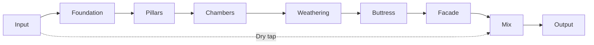

# Monument

Monument is an abstract, architectural reverb for impossible-scale space.
It is a compositional tool for massive, slow, dense, evolving ambience.

Monument is not a room simulator, plate, spring, or convolution reverb.
It is a structure sound enters, not a space that reflects sound.

Core priorities:
- Scale over realism
- Density over echo
- Slow tectonic motion
- Controlled instability
- Mono-safe vastness

---

## Project Status

**Current Phase**: Phase 4 - UI Enhancement (Layered Knobs) 🚧

Monument features a memory-free reverb architecture. Memory Echoes lives in a standalone repository with planned v1.6 reintegration.

**Recent Updates** (2026-01-03):
- ✅ LayeredKnob rendering system with photorealistic layers
- ✅ Blender procedural knob generation pipeline
- ✅ Standardized build workflow (incremental builds in ~6 seconds)
- ✅ Documentation reorganization

---

## Quick Start

### Prerequisites

- macOS 12+
- Xcode 15+ and Command Line Tools
- CMake 3.21+
- Git

### Build and Install

**Recommended**: Use standardized incremental builds (see [STANDARD_BUILD_WORKFLOW.md](STANDARD_BUILD_WORKFLOW.md))

```bash
# Initial setup (first time only)
cmake -B build -DCMAKE_BUILD_TYPE=Release

# Incremental build (6 seconds, auto-installs)
cmake --build build --target Monument_AU --config Release -j8
```

**Legacy scripts** (still supported):
```bash
./scripts/build_macos.sh
./scripts/install_macos.sh
./scripts/open_xcode.sh
```

**Artifacts**: Auto-installed to `~/Library/Audio/Plug-Ins/{Components,VST3}/`

### Generate UI Knobs

See [docs/development/QUICK_START_BLENDER_KNOBS.md](docs/development/QUICK_START_BLENDER_KNOBS.md) for photorealistic knob generation.

```bash
# Generate knob layers with Blender
./scripts/run_blender_knobs.sh

# Preview composite before building
python3 scripts/preview_knob_composite.py --rotation 45
```

---

## Documentation

**Central Hub**: [docs/INDEX.md](docs/INDEX.md)

### Essential Reading

- [ARCHITECTURE.md](ARCHITECTURE.md) - System architecture overview
- [STANDARD_BUILD_WORKFLOW.md](STANDARD_BUILD_WORKFLOW.md) - Build commands
- [MANIFEST.md](MANIFEST.md) - Project vision & roadmap

### Quick Starts

- [docs/development/QUICK_START_BLENDER_KNOBS.md](docs/development/QUICK_START_BLENDER_KNOBS.md) - Generate knobs
- [docs/development/QUICK_START_MACRO_TESTING.md](docs/development/QUICK_START_MACRO_TESTING.md) - Test macros

### Architecture & DSP

- [ARCHITECTURE_QUICK_REFERENCE.md](ARCHITECTURE_QUICK_REFERENCE.md) - Visual diagrams
- [docs/architecture/DSP_ARCHITECTURE.md](docs/architecture/DSP_ARCHITECTURE.md) - Signal flow
- [docs/architecture/PARAMETER_BEHAVIOR.md](docs/architecture/PARAMETER_BEHAVIOR.md) - Parameter contracts

### UI Design

- [docs/ui/LAYERED_KNOB_DESIGN.md](docs/ui/LAYERED_KNOB_DESIGN.md) - Design system
- [docs/ui/LAYERED_KNOB_WORKFLOW.md](docs/ui/LAYERED_KNOB_WORKFLOW.md) - Asset pipeline

### Testing

- [docs/testing/TESTING.md](docs/testing/TESTING.md) - General testing (pluginval)
- [docs/testing/MODULATION_TESTING_GUIDE.md](docs/testing/MODULATION_TESTING_GUIDE.md) - Modulation tests

---

## Signal Flow




**Modules at a glance**:
- **Foundation**: Input conditioning and headroom
- **Pillars**: Early reflection clusters
- **Chambers**: FDN reverb core
- **Weathering**: Slow motion (warp, drift)
- **Buttress**: Feedback safety and limiting
- **Facade**: Stereo imaging, air, width, and mix

---

## Parameters

All parameters are normalized to [0, 1] unless noted. Mix is [0, 100].


### Primary Controls

| Control | Meaning | Behavior notes |
| --- | --- | --- |
| Time | Tail duration | Maps to feedback gain for long T60 values |
| Mass | Weight and darkness | Increases damping and low-end persistence |
| Density | Reflection complexity | Higher values increase diffusion and continuity |
| Bloom | Late swell | Shapes a slow envelope on late field injection |
| Air | Upper-band lift | Adds openness without harshness |
| Width | Stereo spread | Applies to wet only, keeps mono-safe center |
| Mix (0-100) | Wet/dry blend | Constant-power crossfade |

### Advanced Controls

| Control | Meaning | Behavior notes |
| --- | --- | --- |
| Warp | Space topology bend | Morphs orthogonal FDN matrices at sub-Hz rates |
| Drift | Micro motion | Per-line slow LFO delay offsets, ultra subtle |
| Gravity | Spectral tilt | Frequency-dependent decay and high-pass gravity |
| Freeze | Infinite hold | Locks FDN state, mutes input, smooth crossfade |
| Pillar Shape | Early reflection spacing | Compresses or expands tap intervals |
| Pillar Mode | Early reflection palette | Glass, Stone, Fog tap profiles |

### Macro Controls (Phase 2 - Integrated ✅)

Monument includes a high-level macro system that coordinates multiple parameters for conceptual sound design.

| Macro | Meaning | Influences |
| --- | --- | --- |
| Material | Surface character (soft → hard) | Time, Mass, Density |
| Topology | Spatial geometry (regular → non-Euclidean) | Warp, Drift |
| Viscosity | Medium resistance (airy → thick) | Time, Air, Mass |
| Evolution | Temporal change (static → evolving) | Bloom, Drift |
| Chaos | Unpredictable motion (stable → chaotic) | Warp, Drift |
| Elasticity | Deformation speed (instant → slow) | Reserved for future |

**Modulation Matrix** (Phase 3 - Complete ✅):
- 4 source types: Chaos Attractor, Audio Follower, Brownian Motion, Envelope Tracker
- 16 parameter destinations
- 64+ simultaneous connections
- See [docs/testing/MODULATION_TESTING_GUIDE.md](docs/testing/MODULATION_TESTING_GUIDE.md)

---

## Presets

Monument ships with curated, whimsical presets that explore extremes and hybrids.

- Init Patch: neutral starting point for new spaces
- Cathedral of Glass: long, bright, high density shimmer
- Event Horizon: dark, swelling tail with bent geometry
- Folded Atrium: medium time, strong warp, controlled bloom
- Monumental Void: massive, sparse, and hollow
- Zero-G Garden: short, blooming, weightless room
- Hall of Mirrors: warped reflections, medium density
- Tesseract Chamber: long, low density, high drift
- Stone Circles: tight, dry, and grounded
- Frozen Monument (Engage Freeze): tuned for Freeze captures

User presets can be saved as JSON in `~/Documents/MonumentPresets/`.

See [docs/PRESET_GALLERY.md](docs/PRESET_GALLERY.md) for full descriptions.

---

## Testing and Validation

- **Automated**: pluginval via `./scripts/run_pluginval.sh` (see [docs/testing/TESTING.md](docs/testing/TESTING.md))
- **Optional logging**: Enable `MONUMENT_TESTING` for peak and block timing
- **Performance**: REAPER Performance Monitor with 50-100 instances
- **Instrumentation**: Instruments, AddressSanitizer, or Valgrind for leak checks

---

## Project Structure

```
monument-reverb/
├── plugin/           # JUCE processor and editor
├── dsp/              # DSP modules (to be created)
├── ui/               # Custom UI components (LayeredKnob)
├── assets/ui/        # Knob layer PNGs
├── scripts/          # Build scripts, Blender knob generation
├── tests/            # CTest coverage
├── docs/             # Documentation (see docs/INDEX.md)
└── build/            # CMake build output (gitignored)
```

---

## Development Phases

- **Phase 1**: ✅ Foundation (JUCE setup, basic reverb, parameters)
- **Phase 2**: ✅ Memory system (4 dynamic slots, morphing)
- **Phase 3**: ✅ Modulation sources (Chaos, Audio, Brownian, Envelope)
- **Phase 4**: 🚧 UI Enhancement (Layered knobs in progress)
- **Phase 5**: 📋 Macro controls (high-level DSP)
- **Phase 6**: 📋 Physical modules (Tubes, Elastic spaces)

See [ARCHITECTURE.md](ARCHITECTURE.md) for detailed roadmap.

---

## Contributing

See [CONTRIBUTING.md](CONTRIBUTING.md) for contribution guidelines.

---

## License

MIT. See [LICENSE](LICENSE).
