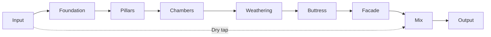
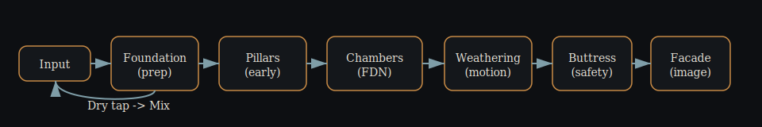
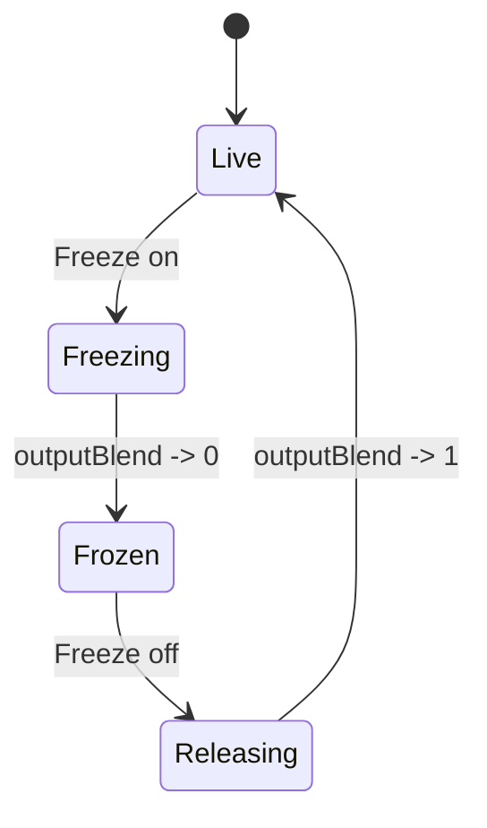
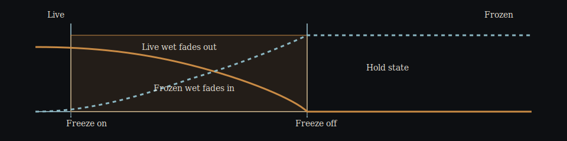
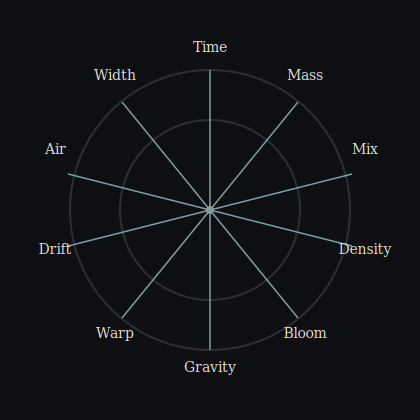
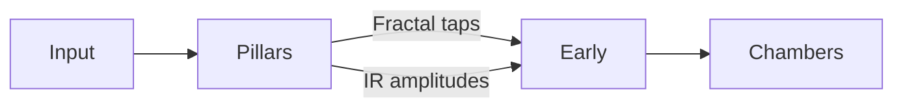
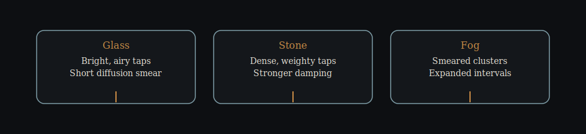

# Monument

Monument is an abstract, architectural reverb for impossible-scale space.
It is a compositional tool for massive, slow, dense, evolving ambience.

Monument is not a room simulator, plate, spring, or convolution reverb.
It is a structure sound enters, not a space that reflects sound.

Core priorities:
- Scale over realism
- Density over echo
- Slow tectonic motion
- Controlled instability
- Mono-safe vastness

## User manual and design docs

- docs/Monument_User_Manual.html
- docs/PARAMETER_BEHAVIOR.md
- docs/DSP_ARCHITECTURE.md
- docs/TESTING.md
- docs/ADVANCED_FEATURES.md
- docs/Monument_v1.0_Pre-Memory_Validation.md
- MONUMENT_MANIFEST.md

## Quick start (macOS, Apple Silicon)

### Prerequisites

- macOS 12+
- Xcode 15+ and Xcode Command Line Tools
- CMake 3.21+
- Git

### Build and install

The fastest path is the build and install scripts:

```sh
./scripts/build_macos.sh
./scripts/install_macos.sh
```

To generate and open the Xcode project:

```sh
./scripts/open_xcode.sh
```

### Canonical build, test, and development commands

```sh
./scripts/build_macos.sh
./scripts/open_xcode.sh
cmake -S . -B build -G Xcode -DCMAKE_OSX_ARCHITECTURES=arm64
cmake --build build --config Release
ctest --test-dir build -C Release
```

### Using a local JUCE checkout

By default, JUCE is fetched via CMake FetchContent. To use a local JUCE checkout:

```sh
cmake -S . -B build -G Xcode \
  -DMONUMENT_USE_LOCAL_JUCE=ON \
  -DJUCE_SOURCE_DIR=/path/to/JUCE
cmake --build build --config Release
```

Artifacts are placed under `build/Monument_artefacts/Release` or `build/Monument_artefacts/Debug`.

## Signal flow





**Modules at a glance**
- Foundation: input conditioning and headroom
- Pillars: early reflection clusters
- Chambers: FDN reverb core
- Weathering: slow motion (warp, drift)
- Buttress: feedback safety and limiting
- Facade: stereo imaging, air, width, and mix

## Freeze transitions





## Control compass

All parameters are normalized to [0, 1] unless noted. Mix is [0, 100].



### Primary controls

| Control | Meaning | Behavior notes |
| --- | --- | --- |
| Time | Tail duration | Maps to feedback gain for long T60 values |
| Mass | Weight and darkness | Increases damping and low-end persistence |
| Density | Reflection complexity | Higher values increase diffusion and continuity |
| Bloom | Late swell | Shapes a slow envelope on late field injection |
| Air | Upper-band lift | Adds openness without harshness |
| Width | Stereo spread | Applies to wet only, keeps mono-safe center |
| Mix (0-100) | Wet/dry blend | Constant-power crossfade |

### Advanced controls

| Control | Meaning | Behavior notes |
| --- | --- | --- |
| Warp | Space topology bend | Morphs orthogonal FDN matrices at sub-Hz rates |
| Drift | Micro motion | Per-line slow LFO delay offsets, ultra subtle |
| Gravity | Spectral tilt | Frequency-dependent decay and high-pass gravity |
| Freeze | Infinite hold | Locks FDN state, mutes input, smooth crossfade |
| Pillar Shape | Early reflection spacing | Compresses or expands tap intervals |
| Pillar Mode | Early reflection palette | Glass, Stone, Fog tap profiles |

## Preset gallery

Monument ships with curated, whimsical presets that explore extremes and hybrids.

- Init Patch: neutral starting point for new spaces
- Cathedral of Glass: long, bright, high density shimmer
- Event Horizon: dark, swelling tail with bent geometry
- Folded Atrium: medium time, strong warp, controlled bloom
- Monumental Void: massive, sparse, and hollow
- Zero-G Garden: short, blooming, weightless room
- Hall of Mirrors: warped reflections, medium density
- Tesseract Chamber: long, low density, high drift
- Stone Circles: tight, dry, and grounded
- Frozen Monument (Engage Freeze): tuned for Freeze captures

User presets can be saved as JSON in `~/Documents/MonumentPresets/`.

## Pillars modes





## Testing and validation

- pluginval: run `./scripts/run_pluginval.sh` (see `docs/TESTING.md` for setup).
- REAPER Performance Monitor: load 50-100 instances and compare CPU usage.
- Instrumentation: use Instruments, AddressSanitizer, or Valgrind for leak checks.

## Project layout

- plugin/ - JUCE processor and editor sources
- dsp/ - DSP modules and core processing
- ui/ - UI components
- tests/ - CTest coverage
- scripts/ - maintenance and tooling
- docs/ - documentation and manuals

## License

MIT. See `LICENSE`.
