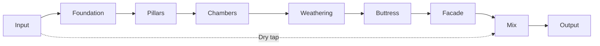

# Monument

Monument is an abstract, architectural reverb for impossible-scale space.
It is a compositional tool for massive, slow, dense, evolving ambience.

Monument is not a room simulator, plate, spring, or convolution reverb.
It is a structure sound enters, not a space that reflects sound.

Core priorities:
- Scale over realism
- Density over echo
- Slow tectonic motion
- Controlled instability
- Mono-safe vastness

---

## Project Status

**Current Phase**: Phase 6 - Polish & Release (in progress) | **Playground Integration**: Phases 0-8 complete ✅

Monument features a memory-free reverb architecture. Memory Echoes lives in a standalone repository with planned v1.6 reintegration.

**Recent Updates** (2026-01-07):

- ✅ **MonumentPlayground**: Standalone UI playground with PBR knobs + particles
- ✅ **Particles**: New particle system extracted under `Source/Particles/`
- ✅ **Smoke Test**: CTest target now instantiates `MonumentAudioProcessor`
- ✅ **Docs**: Added DSP signal flow basics guide

**Recent Updates** (2026-01-04):

**Phase 5 Complete - Physical Modeling Integration** (2026-01-04):

- ✅ **3 New DSP Modules**: TubeRayTracer, ElasticHallway, AlienAmplification
- ✅ **12 New Parameters**: Tube network, elastic walls, non-Euclidean physics
- ✅ **Macro Integration**: Physical parameters driven by Material, Topology, Viscosity, Evolution, Chaos, and Elasticity
- ✅ **5 New Presets**: Metallic Corridor, Elastic Cathedral, Impossible Chamber, Breathing Tubes, Quantum Hall
- ✅ **9 Additional "Living" Presets**: Dynamic Response, Chaotic Motion, Organic Evolution, Experimental Combinations (Task 3)
- ✅ **Total Factory Presets**: 37 curated spaces

**Phase 4 Complete - UI Enhancement** (2026-01-04):

- ✅ **Unified Knob Design**: All 18 knobs use consistent codex brushed aluminum texture
- ✅ **Clean White UI**: White background with dark text for high contrast
- ✅ **Smooth Rotation**: Vertical drag interaction across all parameters
- ✅ **ModMatrixPanel**: Professional modulation matrix UI with 4×15 grid
- ✅ **LayeredKnob System**: Multi-layer rendering with alpha compositing
- ✅ **HIGH Priority Optimizations**: Parameter cache, smoothing, thread safety

---

## Quick Start

### Prerequisites

- macOS 12+
- Xcode 15+ and Command Line Tools
- CMake 3.21+
- Git

### Build and Install

**Recommended**: Use standardized incremental builds (see [STANDARD_BUILD_WORKFLOW.md](STANDARD_BUILD_WORKFLOW.md))

```bash
# Initial setup (first time only)
cmake -B build -DCMAKE_BUILD_TYPE=Release

# Incremental build (6 seconds, auto-installs)
cmake --build build --target Monument_AU --config Release -j8
```

### Canonical Build & Test Commands

```bash
./scripts/build_macos.sh
./scripts/open_xcode.sh
cmake -S . -B build -G Xcode -DCMAKE_OSX_ARCHITECTURES=arm64
cmake --build build --config Release
ctest --test-dir build -C Release
```

**Supplemental scripts** (still supported):
```bash
./scripts/install_macos.sh
```

**Artifacts**: Auto-installed to `~/Library/Audio/Plug-Ins/{Components,VST3}/`

### Generate UI Knobs

See [docs/development/QUICK_START_BLENDER_KNOBS.md](docs/development/QUICK_START_BLENDER_KNOBS.md) for photorealistic knob generation.

```bash
# Generate knob layers with Blender
./scripts/run_blender_knobs.sh

# Preview composite before building
python3 scripts/preview_knob_composite.py --rotation 45
```

### MonumentPlayground (Standalone UI Playground)

```bash
cmake --build build --target MonumentPlayground -j4
open "build/MonumentPlayground_artefacts/Debug/Monument UI Playground.app"
```

---

## Documentation

**Central Hub**: [docs/INDEX.md](docs/INDEX.md)

### Essential Reading

- [ARCHITECTURE.md](ARCHITECTURE.md) - System architecture overview
- [STANDARD_BUILD_WORKFLOW.md](STANDARD_BUILD_WORKFLOW.md) - Build commands
- [MANIFEST.md](MANIFEST.md) - Project vision & roadmap

### Quick Starts

- [docs/development/QUICK_START_BLENDER_KNOBS.md](docs/development/QUICK_START_BLENDER_KNOBS.md) - Generate knobs
- [docs/development/QUICK_START_MACRO_TESTING.md](docs/development/QUICK_START_MACRO_TESTING.md) - Test macros

### Architecture & DSP

- [ARCHITECTURE_QUICK_REFERENCE.md](ARCHITECTURE_QUICK_REFERENCE.md) - Visual diagrams
- [docs/architecture/DSP_ARCHITECTURE.md](docs/architecture/DSP_ARCHITECTURE.md) - Signal flow
- [docs/architecture/PARAMETER_BEHAVIOR.md](docs/architecture/PARAMETER_BEHAVIOR.md) - Parameter contracts
- [docs/DSP_SIGNAL_FLOW_BASICS.md](docs/DSP_SIGNAL_FLOW_BASICS.md) - DSP signal flow basics

### UI Design

- [docs/ui/LAYERED_KNOB_DESIGN.md](docs/ui/LAYERED_KNOB_DESIGN.md) - Design system
- [docs/ui/LAYERED_KNOB_WORKFLOW.md](docs/ui/LAYERED_KNOB_WORKFLOW.md) - Asset pipeline

### Testing

- [docs/testing/TESTING.md](docs/testing/TESTING.md) - General testing (pluginval)
- [docs/testing/MODULATION_TESTING_GUIDE.md](docs/testing/MODULATION_TESTING_GUIDE.md) - Modulation tests
- [docs/TESTING_GUIDE.md](docs/TESTING_GUIDE.md) - Full testing infrastructure

### Plans & Reviews

- [Roadmap.md](Roadmap.md) - Current roadmap
- [ImplementationPlan.md](ImplementationPlan.md) - Implementation plan with Codex prompts
- [01072026-CodeReview.md](01072026-CodeReview.md) - Comprehensive code review
- [01072026-ArchitectureReview.md](01072026-ArchitectureReview.md) - Architecture review
- [01072026-Performance.md](01072026-Performance.md) - Performance and resource review

---

## Signal Flow




**Modules at a glance**:
- **Foundation**: Input conditioning and headroom
- **Pillars**: Early reflection clusters
- **Chambers**: FDN reverb core
- **Weathering**: Slow motion (warp, drift)
- **Buttress**: Feedback safety and limiting
- **Facade**: Stereo imaging, air, width, and mix

---

## Parameters

All parameters are normalized to [0, 1] unless noted. Mix is [0, 100].


### Primary Controls

| Control | Meaning | Behavior notes |
| --- | --- | --- |
| Time | Tail duration | Maps to feedback gain for long T60 values |
| Mass | Weight and darkness | Increases damping and low-end persistence |
| Density | Reflection complexity | Higher values increase diffusion and continuity |
| Bloom | Late swell | Shapes a slow envelope on late field injection |
| Air | Upper-band lift | Adds openness without harshness |
| Width | Stereo spread | Applies to wet only, keeps mono-safe center |
| Mix (0-100) | Wet/dry blend | Constant-power crossfade |

### Advanced Controls

| Control | Meaning | Behavior notes |
| --- | --- | --- |
| Warp | Space topology bend | Morphs orthogonal FDN matrices at sub-Hz rates |
| Drift | Micro motion | Per-line slow LFO delay offsets, ultra subtle |
| Gravity | Spectral tilt | Frequency-dependent decay and high-pass gravity |
| Freeze | Infinite hold | Locks FDN state, mutes input, smooth crossfade |
| Pillar Shape | Early reflection spacing | Compresses or expands tap intervals |
| Pillar Mode | Early reflection palette | Glass, Stone, Fog tap profiles |

### Physical Modeling Controls (Phase 5 Complete ✅)

Monument includes three physics-based modeling modules that create impossible acoustic spaces:

**TubeRayTracer Parameters:**

| Control | Meaning | Behavior notes |
| --- | --- | --- |
| Tube Count | Network complexity | Number of interconnected metal tubes (1-8) |
| Tube Radius Variation | Size diversity | Spread of tube diameters for varied resonance |
| Metallic Resonance | Surface reflectivity | Brightness of metal ringing and harmonic content |
| Tube Coupling Strength | Connection intensity | How strongly tubes influence each other |

**ElasticHallway Parameters:**

| Control | Meaning | Behavior notes |
| --- | --- | --- |
| Wall Elasticity | Deformation amount | How much walls bend under acoustic pressure |
| Recovery Time | Return speed | Time for walls to return to rest position |
| Absorption Drift | Material morphing | Slow evolution of wall absorption properties |
| Elastic Nonlinearity | Deformation curve | Linear vs exponential wall response |

**AlienAmplification Parameters:**

| Control | Meaning | Behavior notes |
| --- | --- | --- |
| Impossibility Degree | Physics violation | Amount of non-Euclidean acoustic behavior |
| Pitch Evolution | Frequency drift | Slow harmonic shifts in impossible space |
| Paradox Frequency | Quantum effect | Rate of acoustic topology folding |
| Paradox Gain | Amplification intensity | Energy gain from impossible reflections |

### Macro Controls & Modulation (Phase 2-4 Complete ✅)

Monument includes a high-level macro system and visual modulation matrix for deep sound design.

**Macro Controls:**

| Macro | Meaning | Influences |
| --- | --- | --- |
| Material | Surface character (soft → hard) | Time, Mass, Density |
| Topology | Spatial geometry (regular → non-Euclidean) | Warp, Drift |
| Viscosity | Medium resistance (airy → thick) | Time, Air, Mass |
| Evolution | Temporal change (static → evolving) | Bloom, Drift |
| Chaos | Unpredictable motion (stable → chaotic) | Warp, Drift |
| Elasticity | Deformation speed (instant → slow) | Reserved for future |

**Modulation Matrix** (Phase 3-4 Complete ✅):

- 4 source types: Chaos Attractor, Audio Follower, Brownian Motion, Envelope Tracker
- 16 parameter destinations with 64+ simultaneous connections
- **Visual UI Panel**: Interactive 4×15 grid for creating/editing connections
- Per-connection depth (-1 to +1) and smoothing (20-1000ms) controls
- Color-coded sources with hover effects and selection states
- Thread-safe real-time updates via SpinLock
- See [docs/testing/MODULATION_TESTING_GUIDE.md](docs/testing/MODULATION_TESTING_GUIDE.md)

---

## Presets

Monument ships with **37 curated presets** that explore extremes, hybrids, physical modeling spaces, and living modulation.

**Core Spaces:**

- Init Patch: neutral starting point for new spaces
- Cathedral of Glass: long, bright, high density shimmer
- Event Horizon: dark, swelling tail with bent geometry
- Folded Atrium: medium time, strong warp, controlled bloom
- Monumental Void: massive, sparse, and hollow
- Zero-G Garden: short, blooming, weightless room
- Hall of Mirrors: warped reflections, medium density
- Tesseract Chamber: long, low density, high drift
- Stone Circles: tight, dry, and grounded
- Frozen Monument (Engage Freeze): tuned for Freeze captures

**Living Spaces (with modulation):**

- Breathing Stone: AudioFollower → Bloom
- Drifting Cathedral: BrownianMotion → Drift + Gravity
- Chaos Hall: ChaosAttractor → Warp + Density
- Living Pillars: EnvelopeTracker → PillarShape
- Event Horizon Evolved: ChaosAttractor → Mass + BrownianMotion → Drift
- Pulsing Cathedral: AudioFollower → Bloom (dynamic reverb swells)
- Dynamic Shimmer: AudioFollower → Air (brightness responds to level)
- Quantum Shimmer: ChaosAttractor → ImpossibilityDegree (physics violations)
- Morphing Cathedral: ChaosAttractor → TubeCount + BrownianMotion → Drift
- Fractal Space: ChaosAttractor → Warp (topology morphing)
- Elastic Drift: BrownianMotion → Elasticity + RecoveryTime (breathing walls)
- Spectral Wander: BrownianMotion → MetallicResonance (drifting brightness)
- Impossible Hall: AudioFollower → ParadoxGain (triggered energy gain)
- Breathing Chaos: ChaosAttractor → Elasticity (intermittent deformation)

**Physical Modeling Spaces (Phase 5):**

- Metallic Corridor: Resonant metal tube network
- Elastic Cathedral: Breathing walls that deform with sound
- Impossible Chamber: Physics-breaking alien acoustics
- Breathing Tubes: Organic metal pipes with modulation
- Quantum Hall: Non-Euclidean tube folding with chaos

User presets can be saved as JSON in `~/Documents/MonumentPresets/`.

See [docs/PRESET_GALLERY.md](docs/PRESET_GALLERY.md) for full descriptions.

---

## Testing and Validation

- **Automated**: pluginval via `./scripts/run_pluginval.sh` (see [docs/testing/TESTING.md](docs/testing/TESTING.md))
- **CTest**: `ctest --test-dir build -C Release` (smoke tests)
- **Optional logging**: Enable `MONUMENT_TESTING` for peak and block timing
- **Performance**: REAPER Performance Monitor with 50-100 instances
- **Instrumentation**: Instruments, AddressSanitizer, or Valgrind for leak checks

---

## Project Structure

```
monument-reverb/
├── plugin/           # JUCE processor and editor
├── dsp/              # DSP modules
├── ui/               # Custom UI components (LayeredKnob)
├── playground/       # Standalone UI playground app
├── Source/Particles/ # Particle simulation + presets (playground)
├── assets/ui/        # Knob layer PNGs
├── assets/knob_*/     # PBR knob packs for playground
├── scripts/          # Build scripts, Blender knob generation
├── tests/            # CTest coverage
├── docs/             # Documentation (see docs/INDEX.md)
└── build/            # CMake build output (gitignored)
```

---

## Development Phases

- **Phase 1**: ✅ Foundation (JUCE setup, FDN reverb, base parameters)
- **Phase 2**: ✅ Macro system (6 high-level controls integrated)
- **Phase 3**: ✅ Modulation sources (4 sources, 16 destinations, living presets)
- **Phase 4**: ✅ UI Enhancement (Complete)
  - ✅ ModMatrix visual panel with interactive grid
  - ✅ LayeredKnob rendering system
  - ✅ Blender knob generation pipeline
  - ✅ Unified codex knob integration
- **Phase 5**: ✅ Physical Modeling (Complete)
  - ✅ TubeRayTracer: Metal tube networks with ray-traced propagation
  - ✅ ElasticHallway: Deformable walls responding to acoustic pressure
  - ✅ AlienAmplification: Non-Euclidean physics with impossible amplification
  - ✅ 12 new parameters with macro mapping integration
  - ✅ 5 new presets exploring physical spaces
  - ✅ 9 additional "Living" presets (Task 3 - Total: 37 presets)
- **Phase 6**: 📋 Polish & release (preset browser, export/import, final optimization)

See [ARCHITECTURE.md](ARCHITECTURE.md) for detailed roadmap.

---

## Contributing

See [CONTRIBUTING.md](CONTRIBUTING.md) for contribution guidelines.

---

## License

MIT. See [LICENSE](LICENSE).
