# Monument Reverb - DSP Signal Flow Basics

> **A Beginner's Guide to Monument's Audio Architecture**
>
> This document explains Monument's DSP modules, signal flow, and sonic capabilities in plain language with visual diagrams. Perfect for understanding how Monument creates its unique sonic character.

---

## Table of Contents

1. [What is Monument?](#what-is-monument)
2. [The Foundation Concept](#the-foundation-concept)
3. [The 7 Core Processing Stages](#the-7-core-processing-stages)
4. [The 3 Physical Modeling Modules](#the-3-physical-modeling-modules)
5. [Complete Signal Flow](#complete-signal-flow)
6. [The 3 Routing Modes](#the-3-routing-modes)
7. [Macro Control System](#macro-control-system)
8. [Modulation Matrix](#modulation-matrix)
9. [Sound Design Examples](#sound-design-examples)

---

## What is Monument?

Monument is a **memory-based reverb plugin** that creates impossible acoustic spaces through:

- **Physical modeling** - Metal tubes, elastic walls, alien physics
- **Macro control** - 10 high-level poetic parameters
- **Modulation matrix** - 4 sources × 16 destinations with 64+ connections
- **Flexible routing** - 3 modes + 8 presets for dramatic sonic variation

**Key Philosophy:** Monument is not a realistic room simulator. It creates **abstract, impossible, evolving spaces** that breathe, morph, and surprise.

---

## The Foundation Concept

Monument's architecture uses an **architectural metaphor**:

```
┌─────────────────────────────────────────────────────────┐
│  Think of Monument like a CATHEDRAL being built:        │
├─────────────────────────────────────────────────────────┤
│  • Foundation  = Ground preparation (input conditioning)│
│  • Pillars     = Support columns (early reflections)    │
│  • Chambers    = Main hall (reverb core)                │
│  • Weathering  = Time & elements (modulation/drift)     │
│  • Physical    = Architectural features (tubes, walls)  │
│  • Buttress    = Structural support (safety limiters)   │
│  • Facade      = Outer face (output imaging)            │
└─────────────────────────────────────────────────────────┘
```

This isn't just a naming convention—each module's role matches its architectural counterpart.

---

## The 7 Core Processing Stages

### Stage 1: Foundation (Input Conditioning)

**Role:** Prepare the incoming audio signal for diffusion

```
┌────────────┐
│   Audio    │
│   Input    │──┐
└────────────┘  │
                ▼
          ╔═══════════╗
          ║ Foundation║
          ║ ─────────║
          ║ • DC Blocker        Removes unwanted DC offset
          ║ • Headroom Control  Manages signal levels
          ║ • Pre-emphasis      Optional EQ tilt
          ║ • Stereo Width      M/S processing prep
          ╚═══════════╝
                │
                ▼
        [Clean Signal Ready for Diffusion]
```

**What it does:**
- Removes DC offset that could cause clicks
- Normalizes input levels for consistent processing
- Optional drive or tilt EQ for tone shaping

**When to adjust:** You rarely need to touch this—it's automatic signal conditioning.

---

### Stage 2: Pillars (Early Reflections)

**Role:** Create dense early reflections that define perceived space size

```
        [Foundation Output]
                │
                ▼
          ╔═══════════╗
          ║  Pillars  ║
          ║ ─────────║
          ║ • Multi-tap Delays     Creates discrete echoes
          ║ • Allpass Diffusers    Scatters reflections
          ║ • Stereo Scatter       Widens image
          ║ • Clustering           Groups reflections
          ╚═══════════╝
                │
                ▼
    [Dense Early Reflection Cluster]

    Time domain visualization:

    Input:  |▮|                    (impulse)
    Output: |▮▯▯▮▯▮▮▯▯▯▮▮▮▯|       (scattered reflections)
            └───20-80ms────┘
```

**What it does:**
- Generates the initial burst of reflections (first 20-80ms)
- Creates the **sense of space size** (small room vs cathedral)
- Stereo width control for narrow/wide imaging

**Parameters:**
- **Density** - How many reflections in the cluster (sparse → dense)
- **Shape** - Reflection pattern (regular → irregular)
- **Warp** - Geometric distortion (Euclidean → impossible geometry)

**Sound Design Tip:** Pillars create the "attack" character of your reverb. Dense = smooth, Sparse = discrete echoes.

---

### Stage 3: Chambers (FDN Reverb Core)

**Role:** The main reverb engine—creates the reverberant tail

```
        [Pillars Output]
                │
                ▼
          ╔═══════════╗
          ║  Chambers ║══════╗
          ║ ─────────║       ║ Feedback Loop
          ║                  ║ (creates sustain)
          ║  ┌─────────┐     ║
          ║  │ Delay 1 │←────╝
          ║  ├─────────┤     ╔════╗
          ║  │ Delay 2 │←────║Mix ║
          ║  ├─────────┤     ║    ║
          ║  │ Delay 3 │←────╚════╝
          ║  ├─────────┤       ▲
          ║  │ Delay 4 │───────┘
          ║  └─────────┘
          ║     (FDN = Feedback Delay Network)
          ╚═══════════╝
                │
                ▼
       [Sustained Reverb Tail]
```

**What it does:**
- Uses a **Feedback Delay Network (FDN)** - the industry-standard reverb algorithm
- Multiple delay lines feed back into each other through a mixing matrix
- Creates the long, sustained reverb tail (200ms - 10+ seconds)
- Absorption filters darken the tail over time (simulates air absorption)

**Parameters:**
- **Time** - Reverb decay length (short → infinite)
- **Mass** - Damping/darkness (bright → dark)
- **Density** - Reflection complexity (sparse → dense)
- **Bloom** - Late-field envelope swell (static → evolving)

**Sound Design Tip:** Chambers IS your reverb sound. Time controls how long it lasts, Mass controls how dark it gets, Density controls texture complexity.

---

### Stage 4: Weathering (Modulation & Drift)

**Role:** Add slow movement to prevent metallic artifacts

```
        [Chambers Output]
                │
                ▼
          ╔═══════════╗
          ║ Weathering║
          ║ ─────────║
          ║ • Slow LFOs         Modulates delay lengths
          ║ • Pitch Drift       Subtle detuning
          ║ • Filter Drift      Absorption changes
          ║ • Random Walk       Brownian motion
          ╚═══════════╝
                │
                ▼
       [Living, Breathing Tail]

    Frequency domain visualization:

    Without Weathering:  ═══════════  (static resonances = metallic)
    With Weathering:     ≋≋≋≋≋≋≋≋≋≋  (moving resonances = organic)
```

**What it does:**
- Prevents the "metallic ringing" artifact common in digital reverbs
- Adds subtle pitch/timing modulation to delay lines
- Creates a "living" quality—the reverb breathes and evolves
- Keeps large spaces from sounding static

**Parameters:**
- **Warp** - Topology distortion amount
- **Drift** - Continuous slow evolution rate
- **Gravity** - Pull toward stability (chaos ← → stable)

**Sound Design Tip:** Weathering is the secret to organic, non-digital reverbs. More drift = more movement. Too much = chorus-like artifacts.

---

### Stage 5-7: Physical Modeling (Optional Advanced Modules)

These three modules create **impossible acoustic spaces** beyond traditional reverb simulation. See [The 3 Physical Modeling Modules](#the-3-physical-modeling-modules) section below.

---

### Stage 6 (Core): Buttress (Safety & Feedback Control)

**Role:** Protect the system from runaway feedback and energy buildup

```
    [Physical Modeling Output]
                │
                ▼
          ╔═══════════╗
          ║  Buttress ║
          ║ ─────────║
          ║ • Soft Limiter      Prevents clipping
          ║ • DC Blocker        Removes DC buildup
          ║ • Energy Monitor    Tracks feedback loops
          ║ • Safety Clamp      Emergency limiting
          ╚═══════════╝
                │
                ▼
          [Safe Output]
```

**What it does:**
- Acts as a "safety net" for feedback loops and parallel routing
- Soft limiting prevents harsh clipping
- Monitors total energy to prevent runaway buildup
- Automatically engages in "Breathing Stone" mode (most aggressive)

**Parameters:**
- **Drive** - Soft saturation amount (clean → warm)

**Sound Design Tip:** Buttress is mostly automatic. You only adjust Drive for saturation color. Trust it to keep things safe.

---

### Stage 7 (Core): Facade (Output Imaging)

**Role:** Final stereo imaging, EQ, and wet/dry mix

```
          [Buttress Output]
                │
                ▼
          ╔═══════════╗
          ║   Facade  ║
          ║ ─────────║
          ║ • Stereo Width      M/S control
          ║ • High-shelf EQ     Air/brightness
          ║ • Wet/Dry Mix       Blend amount
          ║ • Output Gain       Final level
          ╚═══════════╝
                │
                ▼
          ╔═══════╗
          ║ Output║══▶ To DAW/Speakers
          ╚═══════╝
```

**What it does:**
- Controls final stereo width (mono → ultra-wide)
- High-shelf EQ for "air" and brightness
- Wet/dry mix (100% wet for aux sends, mixed for inserts)
- Final output gain trim

**Parameters:**
- **Air** - High-frequency brightness (dark → airy)
- **Width** - Stereo imaging (mono → super-wide)
- **Mix** - Wet/dry balance (0% = dry, 100% = wet)

**Sound Design Tip:** Air is your final tone control. Width is powerful—be careful not to over-widen or you'll lose mono compatibility.

---

## The 3 Physical Modeling Modules

These modules create **impossible acoustic spaces** that violate real-world physics.

### TubeRayTracer: Metal Tube Networks

**Concept:** Sound bounces through interconnected metal tubes with ray-traced propagation

```
    ┌─────────────────────────────────────────┐
    │  Metal Tube Network (Top View)          │
    ├─────────────────────────────────────────┤
    │                                          │
    │   ┌─Tube 1──┐                            │
    │   │ø 2.5cm  │─┐                          │
    │   └─────────┘ │  ┌─Tube 3──┐             │
    │                └─│ø 4.1cm  │─┐           │
    │   ┌─Tube 2──┐   └─────────┘ │           │
    │   │ø 1.8cm  │─────────────────┤          │
    │   └─────────┘               ┌─Tube 4──┐  │
    │                             │ø 3.2cm  │  │
    │   [Sound bounces between tubes,        │
    │    creating metallic resonances]       │
    └─────────────────────────────────────────┘

    Impulse Response:

    Input:   |▮|
    Output:  |▮|──riiing──iiing──iiing────ng──
             └─ Metallic ringing with harmonic decay
```

**What it does:**
- Simulates 1-8 metal tubes with varying diameters
- Ray-tracing algorithm models sound bouncing inside tubes
- Creates **bright, metallic, harmonic resonances**
- Tubes can couple (share energy) for complex timbres

**Parameters:**
- **Tube Count** - Number of tubes in network (1-8)
- **Radius Variation** - Diameter spread (uniform → diverse)
- **Metallic Resonance** - Surface reflectivity (damped → bright ringing)
- **Coupling Strength** - Energy transfer between tubes (isolated → interactive)

**Use Cases:**
- Industrial/sci-fi spaces
- Shimmer effects with harmonic ringing
- Metallic percussion tails
- Bright, resonant chambers

---

### ElasticHallway: Deformable Walls

**Concept:** Walls physically bend under sound pressure and recover slowly

```
    ┌─────────────────────────────────────────┐
    │  Wall Deformation Over Time             │
    ├─────────────────────────────────────────┤
    │                                          │
    │  t=0ms:   ║       ║  (rigid walls)       │
    │            Sound hits ▼                   │
    │                                          │
    │  t=50ms:  ║)      (║  (walls push out)    │
    │             ◀─elastic deformation        │
    │                                          │
    │  t=200ms: ║  (  )  ║  (walls bulge)       │
    │                                          │
    │  t=500ms: ║)      (║  (recovering)        │
    │                                          │
    │  t=1s:    ║       ║  (back to rest)      │
    │                                          │
    └─────────────────────────────────────────┘

    Effect on sound:
    • Reflections change angle as walls move
    • Absorption drifts (material morphing)
    • Creates "breathing" organic character
```

**What it does:**
- Walls deform like elastic membranes under acoustic pressure
- Spring-like recovery (20ms - 1000ms)
- Absorption coefficient evolves over time (material drift)
- Creates **organic, breathing, living spaces**

**Parameters:**
- **Wall Elasticity** - Maximum deformation (rigid → highly elastic)
- **Recovery Time** - Return-to-rest speed (fast snap-back → slow creep)
- **Absorption Drift** - Material evolution rate (static → morphing)
- **Elastic Nonlinearity** - Deformation curve (linear → exponential)

**Use Cases:**
- Breathing cathedral spaces
- Organic evolving textures
- Living rooms that respond to input
- Pad swells and cinematic builds

---

### AlienAmplification: Impossible Physics

**Concept:** Violates acoustic laws—sound **gains** energy and folds through impossible topology

```
    ┌─────────────────────────────────────────┐
    │  Non-Euclidean Acoustic Space           │
    ├─────────────────────────────────────────┤
    │                                          │
    │   Input: ▮───▸ (Sound enters)            │
    │                                          │
    │   [Impossible Reflection]                │
    │    ╱│╲  Sound hits "paradox point"      │
    │   ╱ │ ╲  and AMPLIFIES instead of       │
    │  ▮──▮──▮ decaying (violates physics)    │
    │   ╲ │ ╱                                  │
    │    ╲│╱  Topology folds periodically     │
    │                                          │
    │   Output: ▮▮▮▮▮▮▮ (Gained energy!)       │
    │                                          │
    └─────────────────────────────────────────┘

    Energy profile:

    Normal reverb:  ▁▂▃▅▄▃▂▁ (decays)
    Alien mode:     ▁▂▃▅▇█▇▅ (swells impossibly)
```

**What it does:**
- Acoustic reflections **amplify** instead of decay (impossible!)
- Pitch evolution—harmonics shift slowly over time
- Topology "folds" at periodic intervals (paradox events)
- Creates **surreal, impossible, energy-gaining spaces**

**Parameters:**
- **Impossibility Degree** - Physics violation amount (subtle → extreme)
- **Pitch Evolution** - Harmonic drift rate (stable → morphing)
- **Paradox Frequency** - Topology fold rate (rare → frequent)
- **Paradox Gain** - Energy amplification intensity (subtle → strong)

**Use Cases:**
- Infinite reverb builds
- Sci-fi/horror sound design
- Impossible spaces that defy reality
- Swelling cinematic effects
- Shimmer-like pitch evolution

---

## Complete Signal Flow

### Ancient Way (Traditional Mode)

The default processing chain—balanced and musical:

```mermaid
graph LR
    A([Audio Input]) --> B[Foundation<br/>Input Conditioning]
    B --> C[Pillars<br/>Early Reflections]
    C --> D[Chambers<br/>FDN Reverb Core]
    D --> E[Weathering<br/>Modulation & Drift]

    E --> F[TubeRayTracer<br/>Metal Tubes]
    F --> G[ElasticHallway<br/>Deformable Walls]
    G --> H[AlienAmplification<br/>Impossible Physics]

    H --> I[Buttress<br/>Safety Limiter]
    I --> J[Facade<br/>Output Imaging]

    B -.Dry Tap.-> K{Wet/Dry Mix}
    J --> K
    K --> L([Audio Output])

    style D fill:#ffe1e1
    style F fill:#e1ffe1
    style G fill:#e1ffe1
    style H fill:#e1ffe1
```



**Processing Order:**
1. Foundation → Pillars → Chambers → Weathering (reverb core)
2. Physical modeling (Tubes → Elastic → Alien)
3. Safety & output (Buttress → Facade)

**Character:** Musical, balanced, predictable. Physical modules color the reverb tail.

---

### ASCII Diagram (for quick reference)

```
                    Monument Signal Flow
    ┌───────────────────────────────────────────────────┐
    │                                                   │
    │  Input ──▶ Foundation ──▶ Pillars ──▶ Chambers   │
    │                              ▲            │       │
    │                              │            ▼       │
    │                         [Dry Tap]    Weathering   │
    │                              │            │       │
    │                              │            ▼       │
    │                              │      TubeRayTracer │
    │                              │            │       │
    │                              │            ▼       │
    │                              │    ElasticHallway  │
    │                              │            │       │
    │                              │            ▼       │
    │                              │   AlienAmplification│
    │                              │            │       │
    │                              │            ▼       │
    │                              │       Buttress     │
    │                              │            │       │
    │                              │            ▼       │
    │                              └────▶  Wet/Dry Mix  │
    │                                         │         │
    │                                         ▼         │
    │                                     Output        │
    │                                                   │
    └───────────────────────────────────────────────────┘

    Key Stages:
    ═══════════════════════════════════════════════════════
    Foundation  = Clean up input signal
    Pillars     = Early reflections (20-80ms)
    Chambers    = Main reverb tail (FDN core)
    Weathering  = Modulation to prevent metallic sound
    Physical    = Tubes, Elastic, Alien (impossible spaces)
    Buttress    = Safety limiting
    Facade      = Output imaging and mix
```

---

## The 3 Routing Modes

Monument offers **3 dramatically different routing modes** that reorder the same modules for sonic variety.

### Mode 1: Ancient Way (Traditional)

**Order:** Foundation → Pillars → Chambers → Weathering → Tubes → Elastic → Alien → Buttress → Facade

**Character:** Balanced, musical, predictable
**Physics:** Traditional placement (AFTER reverb core colors the tail)

```
    Reverb Core              Physical Modeling
    ┌──────────────┐        ┌────────────────┐
    │ Chambers     │───▶    │ Tubes → Elastic│
    │ + Weathering │        │    → Alien     │
    └──────────────┘        └────────────────┘
         Smooth tail      Adds metallic/organic color
```

**Use case:** General-purpose reverb, music production, balanced tones

---

### Mode 2: Resonant Halls (Metallic-First)

**Order:** Foundation → Pillars → **TubeRayTracer** → Chambers → Weathering → Elastic → Alien → Buttress → Facade

**Character:** Bright metallic resonances dominate
**Physics:** Tubes BEFORE Chambers (resonances get reverberated)

```
    Physical First           Reverb Amplifies It
    ┌──────────────┐        ┌────────────────┐
    │ TubeRayTracer│───▶    │ Chambers       │
    │ (resonances) │        │ (multiplies!)  │
    └──────────────┘        └────────────────┘
     Bright ringing       Becomes huge shimmer
```

**Use case:** Shimmer effects, metallic spaces, industrial sounds, bright percussive tails

---

### Mode 3: Breathing Stone (Elastic-Core)

**Order:** Foundation → Pillars → **ElasticHallway** → Chambers → **ElasticHallway** → Weathering → Tubes → Alien → Buttress → Facade

**Character:** Organic breathing reverb
**Physics:** Elastic **SANDWICHES** Chambers (pre + post passes)

```
    Elastic Pre-Pass         Core              Elastic Post-Pass
    ┌──────────────┐        ┌──────┐          ┌──────────────┐
    │ Elastic      │───▶    │Chambers│───▶    │ Elastic      │
    │ (deforms)    │        │(reverb)│        │ (deforms)    │
    └──────────────┘        └──────┘          └──────────────┘
     Walls breathe in     Reverb tail      Walls breathe out
```

**Use case:** Living spaces, evolving textures, organic pads, experimental sound design

**Warning:** This mode can build energy—Buttress safety clipping automatically engages.

---

### Mode Comparison Table

| Aspect | Ancient Way | Resonant Halls | Breathing Stone |
|--------|-------------|----------------|-----------------|
| **Character** | Balanced | Bright/Metallic | Organic/Breathing |
| **Physics** | After reverb | Tubes first | Elastic sandwich |
| **Timbre** | Neutral | Harmonic ringing | Evolving/morphing |
| **Energy** | Stable | Bright buildup | Can self-amplify |
| **CPU** | Baseline | Same | Same (safety clipping) |
| **Best for** | Music production | Shimmer/industrial | Pads/experimental |

**Mode Switching:** Use the dropdown in the top toolbar. Crossfades smoothly (50ms) to prevent clicks.

---

## Macro Control System

Monument features **10 poetic macro controls** (Ancient Monuments) that coordinate multiple parameters musically.

### The 10 Ancient Monuments

```
┌────────────────────────────────────────────────────────┐
│  Macro System: High-Level → Low-Level Coordination    │
├────────────────────────────────────────────────────────┤
│                                                        │
│  USER ADJUSTS:                                         │
│  ┌──────────┐                                          │
│  │ STONE    │  (soft → hard)                           │
│  │ LABYRINTH│  (simple → complex)                      │
│  │ MIST     │  (clear → dense)                         │
│  │ BLOOM    │  (static → evolving)                     │
│  │ TEMPEST  │  (calm → turbulent)                      │
│  │ ECHO     │  (immediate → eternal)                   │
│  │ PATINA   │  (pristine → aged)                       │
│  │ ABYSS    │  (surface → bottomless)                  │
│  │ CORONA   │  (muted → radiant)                       │
│  │ BREATH   │  (still → pulsing)                       │
│  └──────────┘                                          │
│       │                                                │
│       ▼                                                │
│  ┌─────────────────┐                                   │
│  │ MacroMapper     │  (translates to parameters)      │
│  └─────────────────┘                                   │
│       │                                                │
│       ▼                                                │
│  DSP PARAMETERS CHANGE:                                │
│  • Time, Mass, Density                                 │
│  • Warp, Drift, Bloom                                  │
│  • Air, Gravity, Width                                 │
│  • + 7 more physical modeling params                   │
│                                                        │
└────────────────────────────────────────────────────────┘
```

### Macro Examples

#### Stone (Macro 1): Material Density

**Range:** Soft (0.0) → Hard (1.0)

**What it controls:**
- Time ↑ (longer decay)
- Mass ↑ (darker tone)
- Density ↑ (complex reflections)
- Buttress Drive ↑ (subtle)

**Musical intent:** Surface character—absorptive cotton vs reflective stone

**Example:** Stone = 0.9 → Long, dark, dense reverb (cathedral stone walls)

---

#### Labyrinth (Macro 2): Spatial Complexity

**Range:** Simple (0.0) → Complex (1.0)

**What it controls:**
- Warp ↑ (direct—geometry distortion)
- Drift ↑ (spatial micro-shifts)
- Pillar Warp ↑ (reflection chaos)

**Musical intent:** Geometric complexity—straight hallway vs maze

**Example:** Labyrinth = 0.8 → Non-Euclidean space with impossible reflections

---

#### Mist (Macro 3): Atmospheric Density

**Range:** Clear (0.0) → Dense (1.0)

**What it controls:**
- Air ↓ (inverse—less brightness)
- Time ↓ (shorter decay)
- Mass ↑ (more absorption)

**Musical intent:** Atmosphere thickness—clear vs foggy

**Example:** Mist = 0.7 → Thick, muffled, short reverb (dense fog)

---

#### Bloom (Macro 4): Temporal Evolution

**Range:** Static (0.0) → Evolving (1.0)

**What it controls:**
- Bloom ↑ (direct—late-field swell)
- Drift ↑ (temporal motion)

**Musical intent:** How the space evolves over time

**Example:** Bloom = 0.8 → Reverb swells and grows over time (cinematic)

---

### Macro Blending Algorithm

Monument uses **distance-based blending** to smoothly transition from manual control to macro control:

```
┌─────────────────────────────────────────────────┐
│  Influence Calculation:                         │
│                                                 │
│  1. Measure each macro's distance from default: │
│     stoneΔ = |stone - 0.5|                      │
│     labyrinthΔ = |labyrinth - 0.5|              │
│     ... (all 10 macros)                         │
│                                                 │
│  2. Sum total deviation:                        │
│     totalΔ = stoneΔ + labyrinthΔ + ...          │
│                                                 │
│  3. Calculate influence (0.0 → 1.0):            │
│     influence = min(1.0, totalΔ × 2.0)          │
│                                                 │
│  4. Blend each parameter:                       │
│     effectiveParam = lerp(userParam,            │
│                           macroTarget,          │
│                           influence)            │
│                                                 │
│  Result:                                        │
│  • All macros at defaults → user has full control│
│  • Macros moved → smooth transition to coordination│
│  • Multiple macros active → full macro control  │
│                                                 │
└─────────────────────────────────────────────────┘
```

**Example:**
- User sets Time = 0.5 manually
- User moves Stone = 0.9 (hard surfaces)
- MacroMapper says: "Hard stone wants Time = 0.77"
- Blending: influence = 0.8 (strong macro deviation)
- Final Time = 0.5×(1-0.8) + 0.77×0.8 = **0.716**
- Result: Time increases toward macro target, but user's base still influences

---

## Modulation Matrix

Monument's modulation system routes **4 sources** to **16+ destinations** with **64+ simultaneous connections**.

### The 4 Modulation Sources

```
┌────────────────────────────────────────────────────────┐
│  1. CHAOS ATTRACTOR                                    │
│  ┌──────────────────────────────────┐                  │
│  │   3D Attractor (Lorenz/Rössler)  │                  │
│  │   ╱│╲                             │                  │
│  │  ╱ │ ╲  X, Y, Z axes             │                  │
│  │ •──•──• (strange attractor)      │                  │
│  │  ╲ │ ╱                            │                  │
│  │   ╲│╱  Never repeats!            │                  │
│  └──────────────────────────────────┘                  │
│  • 3 outputs (X, Y, Z)                                 │
│  • Deterministic chaos (repeatable)                    │
│  • Use for: Unpredictable evolution                    │
│                                                        │
├────────────────────────────────────────────────────────┤
│  2. AUDIO FOLLOWER                                     │
│  ┌──────────────────────────────────┐                  │
│  │   Input Signal Analysis          │                  │
│  │   ▁▂▃▅▇█▇▅▃▂▁ (RMS envelope)     │                  │
│  │   └─────────────▶ Smoothed       │                  │
│  └──────────────────────────────────┘                  │
│  • 1 output (RMS amplitude)                            │
│  • Tracks input dynamics                               │
│  • Use for: Input-reactive modulation                  │
│                                                        │
├────────────────────────────────────────────────────────┤
│  3. BROWNIAN MOTION                                    │
│  ┌──────────────────────────────────┐                  │
│  │   Random Walk (1/f noise)        │                  │
│  │   ≈≈≈≈≈≈≈≈≈≈≈ (smooth drift)     │                  │
│  │   No sudden jumps                │                  │
│  └──────────────────────────────────┘                  │
│  • 1 output (continuous drift)                         │
│  • Smooth, organic randomness                          │
│  • Use for: Slow parameter evolution                   │
│                                                        │
├────────────────────────────────────────────────────────┤
│  4. ENVELOPE TRACKER                                   │
│  ┌──────────────────────────────────┐                  │
│  │   Multi-stage ADSR Envelope      │                  │
│  │   ╱▔▔▔▔╲ (A-D-S-R)               │                  │
│  │  ╱      ╲___╲_ Customizable      │                  │
│  └──────────────────────────────────┘                  │
│  • 1 output (envelope follower)                        │
│  • Tracks amplitude with stages                        │
│  • Use for: Dynamic response to transients             │
│                                                        │
└────────────────────────────────────────────────────────┘
```

### Connection System

Each connection specifies:

```
┌────────────────────────────────────────────────────────┐
│  Connection Properties:                                │
│                                                        │
│  • Source: Which modulation source (1-4)               │
│  • Source Axis: For multi-output sources (X/Y/Z)      │
│  • Destination: Which parameter to modulate            │
│  • Depth: Modulation amount (-1.0 to +1.0)            │
│  • Smoothing: Transition time (20-1000ms)             │
│  • Probability: Gate chance (0-100%)                   │
│                                                        │
│  Example Connection:                                   │
│  ┌─────────────────────────────────────┐               │
│  │ Source: Chaos Attractor             │               │
│  │ Axis: X                             │               │
│  │ Destination: Time                   │               │
│  │ Depth: +0.5                         │               │
│  │ Smoothing: 200ms                    │               │
│  │ Probability: 80%                    │               │
│  └─────────────────────────────────────┘               │
│                                                        │
│  Result: Chaos X-axis modulates Time parameter         │
│         with +0.5 depth, smoothed over 200ms,          │
│         and only active 80% of the time                │
│                                                        │
└────────────────────────────────────────────────────────┘
```

### Visual UI: ModMatrix Panel

Monument features an **interactive 4×15 grid panel** for visual modulation editing:

```
    ModMatrix Panel (4 sources × 15 destinations)
    ┌─────────────────────────────────────────────┐
    │        Time Mass Density Bloom Air Width ... │
    │ Chaos   [●]  [●]   [ ]    [●]  [ ]  [ ]      │ ← Row 1: Chaos
    │ Audio   [ ]  [ ]   [●]    [ ]  [●]  [ ]      │ ← Row 2: Audio
    │ Brown   [●]  [ ]   [ ]    [ ]  [ ]  [●]      │ ← Row 3: Brownian
    │ Envelope[ ]  [●]   [●]    [●]  [ ]  [ ]      │ ← Row 4: Envelope
    └─────────────────────────────────────────────┘

    [●] = Active connection (click to toggle)
    [ ] = No connection

    Color coding:
    • Red = Chaos Attractor
    • Green = Audio Follower
    • Blue = Brownian Motion
    • Yellow = Envelope Tracker
```

**Features:**
- Click cells to toggle connections
- Right-click for depth/smoothing/probability controls
- 5 preset slots for saving routing configurations
- Randomization modes (Sparse/Normal/Dense)

---

## Sound Design Examples

### Example 1: Hard Stone Cathedral

**Goal:** Long, dark, dense reverb like a medieval cathedral

**Settings:**
- **Stone** = 0.9 (hard surfaces)
- **Echo** = 0.8 (long decay)
- **Abyss** = 0.6 (deep space)
- **Mode:** Ancient Way

**Result:** 8-second decay, dark tone, complex reflections

---

### Example 2: Breathing Pad Swell

**Goal:** Organic, evolving reverb that breathes with the input

**Settings:**
- **Bloom** = 0.85 (strong evolution)
- **Breath** = 0.7 (pulsing)
- **Mode:** Breathing Stone (elastic sandwich)
- **Modulation:** Audio Follower → Wall Elasticity (depth +0.6)

**Result:** Reverb swells and contracts with input dynamics, walls breathe

---

### Example 3: Industrial Metallic Shimmer

**Goal:** Bright, ringing, metallic reverb for sci-fi sounds

**Settings:**
- **Tube Count** = 0.75 (6 tubes)
- **Metallic Resonance** = 0.8 (bright ringing)
- **Mode:** Resonant Halls (tubes first)
- **Modulation:** Chaos → Tube Coupling (depth +0.4)

**Result:** Bright harmonic shimmer with chaotic tube coupling

---

### Example 4: Impossible Infinite Sustain

**Goal:** Physics-breaking space where reverb never decays

**Settings:**
- **Impossibility Degree** = 0.9 (extreme physics violation)
- **Paradox Gain** = 0.8 (strong amplification)
- **Echo** = 0.9 (long base decay)
- **Mode:** Ancient Way
- **Modulation:** Brownian → Pitch Evolution (depth +0.3)

**Result:** Reverb sustains indefinitely, pitch drifts slowly (surreal!)

---

## Quick Reference: When to Use Which Module

| Want to... | Adjust This | Module |
|-----------|-------------|---------|
| Make reverb longer | Time, Echo macro | Chambers |
| Make reverb darker | Mass, Stone macro | Chambers |
| Add early reflections | Density | Pillars |
| Prevent metallic sound | Drift | Weathering |
| Add organic breathing | Wall Elasticity, Bloom | ElasticHallway |
| Add metallic shimmer | Tube Count, Metallic Resonance | TubeRayTracer |
| Create impossible sustain | Impossibility Degree | AlienAmplification |
| Widen stereo image | Width | Facade |
| Brighten top end | Air | Facade |
| Control wet/dry blend | Mix | Facade |

---

## Further Reading

**Detailed Technical Documentation:**
- [DSP_ARCHITECTURE.md](architecture/DSP_ARCHITECTURE.md) - Complete technical specs
- [ARCHITECTURE_REVIEW.md](architecture/ARCHITECTURE_REVIEW.md) - Senior engineer review
- [PARAMETER_BEHAVIOR.md](architecture/PARAMETER_BEHAVIOR.md) - Parameter mappings

**Testing & Validation:**
- [MODULATION_TESTING_GUIDE.md](testing/MODULATION_TESTING_GUIDE.md) - Test modulation system
- [PHASE_3_COMPLETE_SUMMARY.md](archive/phases/PHASE_3_COMPLETE_SUMMARY.md) - Phase 3 results

**Preset Gallery:**
- [PRESET_GALLERY.md](PRESET_GALLERY.md) - All 28+ presets with descriptions

---

## Summary

Monument creates impossible acoustic spaces through:

1. **7 Core Modules** - Foundation → Pillars → Chambers → Weathering → Buttress → Facade
2. **3 Physical Models** - TubeRayTracer → ElasticHallway → AlienAmplification
3. **10 Macro Controls** - Poetic, high-level parameters that coordinate multiple DSP parameters
4. **4 Modulation Sources** - Chaos, Audio, Brownian, Envelope with 64+ connections
5. **3 Routing Modes** - Ancient Way, Resonant Halls, Breathing Stone for dramatic sonic variety

**Key Insight:** Monument is not about realistic room simulation. It's about creating **abstract, impossible, evolving spaces** that surprise, inspire, and push beyond traditional reverb boundaries.

---

*Generated: 2026-01-07 | Monument Reverb v0.1.0 | For questions, see [ARCHITECTURE.md](../ARCHITECTURE.md)*
