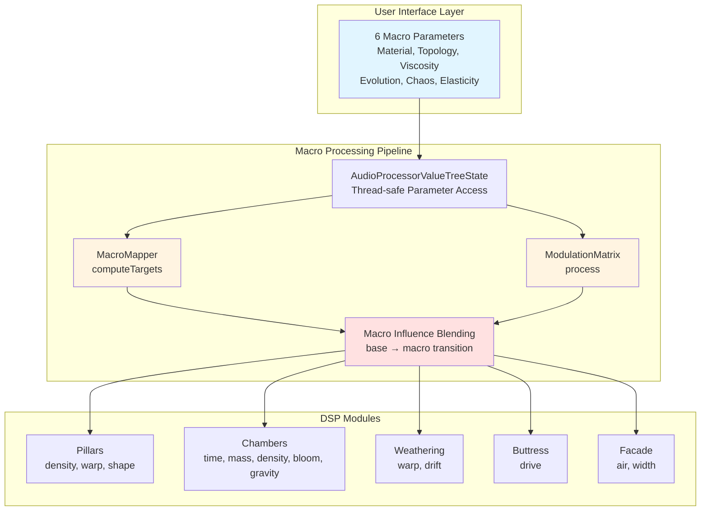

# Monument DSP Architecture

Monument is built as a modular reverb system designed for extreme scale and abstract, impossible spaces. Each module is real-time safe: no dynamic memory allocation, no locks, and no logging inside `process()`.

## Signal Flow

1. **Foundation (input conditioning)**
   Normalizes input, removes DC, manages headroom, and prepares the signal for diffusion. Optional drive or tilt EQ lives here.

2. **Pillars (early reflection clusters)**
   Creates dense early reflections using clustered multi-taps and micro-delays. Focuses on shaping perceived space size and initial depth.

3. **Chambers (FDN reverb core)**
   The main feedback delay network: high-order, matrix-mixed delay lines with absorption and decay control for large-scale, dense spaces.

4. **Weathering (modulation and drift)**
   Modulates delay lengths, diffusion, and filters with slow LFOs and random drift to avoid metallic artifacts and to keep large spaces alive.

5. **Buttress (safety and feedback control)**
   Protects stability: feedback limiting, saturation, and energy control to prevent runaway feedback while preserving tail density.

6. **Facade (output imaging)**
   Stereo imaging, mid/side control, final EQ, and wet/dry output shaping. Handles the final presentation of the space.

## ASCII Audio Path Diagram

```
Input
  |
  v
[Foundation] -> [Pillars] -> [Chambers] -> [Weathering] -> [Buttress] -> [Facade]
  |
  +----------------------------- Dry Tap -------------------------------> Mix -> Output
```

## Module Responsibilities

- **Foundation**: input gain staging, DC removal, pre-emphasis, mono/stereo conditioning.
- **Pillars**: early reflection density, diffusion clusters, stereo scatter/offsets.
- **Chambers**: primary reverb energy and size, high-order FDN core, absorption filters.
- **Weathering**: modulation, drift, and slow movement to prevent static tails.
- **Buttress**: safety limiter for feedback loops, energy balance, optional freeze gating.
- **Facade**: output imaging, tone shaping, wet/dry mix, final trim.

## Real-time Safety Rules

- No dynamic allocation in `process()`.
- No locks, logging, or file IO on the audio thread.
- All large buffers and delay lines are allocated in `prepare()`.

## Macro Control System (Phase 1 & 2 - Complete)

Monument includes a high-level macro control system that coordinates multiple parameters for conceptual sound design. The macro system operates above the individual module parameters, providing musically meaningful control over complex parameter relationships.

### System Architecture



### MacroMapper: High-Level Parameter Coordination

The MacroMapper ([dsp/MacroMapper.h](../dsp/MacroMapper.h)) translates 6 high-level macro parameters into coordinated parameter sets:

#### Macro Parameters & Influence Map

| Macro | Range | Primary Influences | Secondary Influences | Musical Intent |
|-------|-------|-------------------|---------------------|----------------|
| **Material** | soft (0.0) → hard (1.0) | Time ↑, Mass ↑, Density ↑ | Buttress Drive | Surface acoustic properties |
| **Topology** | regular (0.0) → non-Euclidean (1.0) | Warp (direct), Drift ↑ | Pillar Warp | Spatial geometry character |
| **Viscosity** | airy (0.0) → thick (1.0) | Air ↓, Time ↓ | Mass ↑ | Medium resistance |
| **Evolution** | static (0.0) → evolving (1.0) | Bloom (direct), Drift ↑ | — | Temporal dynamics |
| **Chaos** | stable (0.0) → chaotic (1.0) | Drift ↑, Warp ↑ | — | Unpredictability |
| **Elasticity** | instant (0.0) → slow (1.0) | *(Reserved for Phase 3)* | — | Deformation behavior |

#### Detailed Macro Behavior

**Material** (0=soft → 1=hard): Surface character and reflection properties
- **Soft (0.0-0.3)**: Absorptive surfaces → shorter tails, brighter, sparse reflections
- **Medium (0.4-0.6)**: Balanced acoustic response
- **Hard (0.7-1.0)**: Reflective surfaces → longer tails, darker, dense reflections
- **Parameter Mapping**:
  - `time`: 0.3 → 0.8 (feedback duration)
  - `mass`: 0.2 → 0.9 (damping/darkness)
  - `density`: 0.25 → 0.95 (reflection complexity)

**Topology** (0=regular → 1=non-Euclidean): Spatial geometry
- **Regular (0.0-0.3)**: Euclidean space → stable Hadamard matrix, predictable reflections
- **Non-Euclidean (0.7-1.0)**: Impossible geometry → Householder matrix, complex topology
- **Parameter Mapping**:
  - `warp`: direct (matrix morph)
  - `drift`: 0.0 → 0.4 (geometry micro-shifts)

**Viscosity** (0=airy → 1=thick): Medium resistance
- **Airy (0.0-0.3)**: Low resistance → bright, open highs, sound travels freely
- **Thick (0.7-1.0)**: High resistance → muffled, rolled-off highs, shorter effective tail
- **Parameter Mapping**:
  - `air`: 0.8 → 0.2 (inverse: thickness reduces brightness)
  - `time`: 0.6 → 0.4 (inverse: thickness reduces sustain)
  - `mass`: 0.0 → 0.3 (thickness adds damping)

**Evolution** (0=static → 1=evolving): Temporal dynamics
- **Static (0.0-0.3)**: Frozen in time → no envelope shaping, stable geometry
- **Evolving (0.7-1.0)**: Dynamic → strong late-field bloom, subtle motion
- **Parameter Mapping**:
  - `bloom`: direct (envelope swell)
  - `drift`: 0.0 → 0.35 (temporal micro-motion)

**Chaos Intensity** (0=stable → 1=chaotic): Unpredictability
- **Stable (0.0-0.3)**: Predictable, repeatable behavior
- **Chaotic (0.7-1.0)**: Erratic topology shifts and motion
- **Parameter Mapping**:
  - `warp`: 0.0 → 0.3 (additive chaos to topology)
  - `drift`: 0.0 → 0.5 (stronger influence than warp)

**Elasticity Decay** (0=instant → 1=slow): *(Phase 3 - Physical Modeling)*

- Reserved for future elastic hallway and deformable geometry modules
- Will control spring-like deformation response time

### Macro Influence Blending Algorithm (Phase 2)

The system uses a distance-based blending approach that smoothly transitions between user-set base parameters and macro-driven target values:

#### Step 1: Calculate Distance from Defaults

Each macro's deviation from its default value is measured:

- `materialΔ = |material - 0.5|` (default: 0.5)
- `topologyΔ = |topology - 0.5|` (default: 0.5)
- `viscosityΔ = |viscosity - 0.5|` (default: 0.5)
- `evolutionΔ = |evolution - 0.5|` (default: 0.5)
- `chaosΔ = |chaos - 0.0|` (default: 0.0)
- `elasticityΔ = |elasticity - 0.0|` (default: 0.0)

#### Step 2: Compute Total Influence (0.0 → 1.0)

```cpp
totalΔ = materialΔ + topologyΔ + viscosityΔ + evolutionΔ + chaosΔ + elasticityΔ
influence = min(1.0, totalΔ × 2.0)
```

#### Step 3: Blend Each Parameter

```cpp
effectiveParam = lerp(baseParam, macroTarget, influence)
               = (1.0 - influence) × baseParam + influence × macroTarget
```

#### Blending Behavior Examples

| Scenario | Influence | Result | Notes |
| -------- | --------- | ------ | ----- |
| All macros at defaults | 0.0 | `effectiveParam = baseParam` | User has full manual control |
| One macro moved (material=0.8) | ≈0.6 | `effectiveParam = 0.4×base + 0.6×macro` | Significant macro influence, base still matters |
| Multiple macros active | →1.0 | `effectiveParam ≈ macroTarget` | Full macro control, coordinated evolution |

#### Real-World Example: "Hard Stone Cathedral"

Let's walk through a practical sound design scenario:

**Initial State:**
```
User Parameters:
  time = 0.5, mass = 0.6, density = 0.4

Macro Parameters (all at defaults):
  material = 0.5, topology = 0.5, viscosity = 0.5
  evolution = 0.5, chaos = 0.0, elasticity = 0.0

Influence: 0.0 → Using base parameters directly
```

**User Action: Set Material = 0.9** (very hard surfaces)

```
Step 1: MacroMapper Computation
━━━━━━━━━━━━━━━━━━━━━━━━━━━━━━
mapMaterialToTime(0.9)    → 0.77  (long reverb tails)
mapMaterialToMass(0.9)    → 0.83  (darker, more damping)
mapMaterialToDensity(0.9) → 0.91  (complex reflections)

Step 2: Influence Calculation
━━━━━━━━━━━━━━━━━━━━━━━━━━━━
materialΔ = |0.9 - 0.5| = 0.4
totalΔ = 0.4
influence = min(1.0, 0.4 × 2.0) = 0.8

Step 3: Parameter Blending
━━━━━━━━━━━━━━━━━━━━━━━━━
timeEffective    = 0.5×0.2 + 0.77×0.8 = 0.716
massEffective    = 0.6×0.2 + 0.83×0.8 = 0.784
densityEffective = 0.4×0.2 + 0.91×0.8 = 0.808

Result: Reverb becomes longer, darker, and denser—
        characteristics of hard stone surfaces
```

#### Macro Interaction Example: "Thick Stone Space"

**User Action: Material = 0.9, Viscosity = 0.8**

```
MacroMapper Output:
━━━━━━━━━━━━━━━━━━
Material targets:
  time → 0.77, mass → 0.83, density → 0.91

Viscosity targets:
  air → 0.24, time → 0.44, mass → 0.24

Influence Calculation:
━━━━━━━━━━━━━━━━━━━━
materialΔ = 0.4, viscosityΔ = 0.3 → totalΔ = 0.7
influence = min(1.0, 0.7 × 2.0) = 1.0 (saturated)

Combined Effect (weighted influence combining):
━━━━━━━━━━━━━━━━━━━━━━━━━━━━━━━━━━━━━━━━━━━━━━━
time: Material wants 0.77 (60% weight), Viscosity wants 0.44 (40% weight)
      → final = 0.77×0.6 + 0.44×0.4 = 0.638

mass: Material wants 0.83 (70% weight), Viscosity wants 0.24 (30% weight)
      → final = 0.83×0.7 + 0.24×0.3 = 0.653

air:  Viscosity controls directly → 0.24

Result: Long, dark, dense reverb with muffled high frequencies—
        acoustic signature of a thick-medium stone chamber
```

### ModulationMatrix

The ModulationMatrix ([dsp/ModulationMatrix.h](../dsp/ModulationMatrix.h)) provides flexible routing of modulation sources to parameter destinations:

**Modulation Sources** (stub implementations in Phase 1, full DSP in Phase 2):

- **Chaos Attractor**: Deterministic chaos generators (Lorenz/Rössler attractors)
- **Audio Follower**: Input signal envelope tracking (RMS-based)
- **Brownian Motion**: Smooth random walk (1/f noise)
- **Envelope Tracker**: Multi-stage envelope detection

**Parameter Destinations:**

- All 7 primary parameters (Time, Mass, Density, Bloom, Air, Width, Mix)
- All 4 advanced parameters (Warp, Drift, Gravity, Pillar Shape)
- Future physical modeling parameters (Tube Count, Metallic Resonance, Elasticity, Impossibility Degree)

**Connection System:**

- Each connection specifies: source, destination, source axis (for multi-output sources), depth (-1 to +1), and smoothing time (20-1000ms)
- Multiple sources can modulate the same destination (values accumulate)
- Per-destination smoothing using juce::SmoothedValue prevents zipper noise
- Block-rate processing (not sample-rate) for efficiency

**Phase 2-4 Roadmap:**

- Phase 2 (Weeks 3-5): Implement full modulation source DSP
- Phase 3 (Weeks 5-6): Add physical modeling modules (TubeRayTracer, ElasticHallway, AlienAmplification)
- Phase 4 (Weeks 7-8): UI integration, preset showcase, performance optimization
