# Monument DSP Architecture

Monument is built as a modular reverb system designed for extreme scale and abstract, impossible spaces. Each module is real-time safe: no dynamic memory allocation, no locks, and no logging inside `process()`.

## Signal Flow

1. **Foundation (input conditioning)**
   Normalizes input, removes DC, manages headroom, and prepares the signal for diffusion. Optional drive or tilt EQ lives here.

2. **Pillars (early reflection clusters)**
   Creates dense early reflections using clustered multi-taps and micro-delays. Focuses on shaping perceived space size and initial depth.

3. **Chambers (FDN reverb core)**
   The main feedback delay network: high-order, matrix-mixed delay lines with absorption and decay control for large-scale, dense spaces.

4. **Weathering (modulation and drift)**
   Modulates delay lengths, diffusion, and filters with slow LFOs and random drift to avoid metallic artifacts and to keep large spaces alive.

5. **Physical Modeling (Phase 5 - Complete)**
   Three physics-based modules that create impossible acoustic spaces:
   - **TubeRayTracer**: Metal tube networks with ray-traced propagation
   - **ElasticHallway**: Deformable walls responding to acoustic pressure
   - **AlienAmplification**: Non-Euclidean physics with impossible amplification

6. **Buttress (safety and feedback control)**
   Protects stability: feedback limiting, saturation, and energy control to prevent runaway feedback while preserving tail density.

7. **Facade (output imaging)**
   Stereo imaging, mid/side control, final EQ, and wet/dry output shaping. Handles the final presentation of the space.

## 3 Routing Modes (Task 1 - Complete)

Monument features **3 distinct processing modes** that reorder modules for dramatic sonic variation:

### Mode 1: Ancient Way (Traditional)


**Character**: Balanced, musical, predictable - Physical modules AFTER reverb core
**Use case**: General-purpose reverb, music production

### Mode 2: Resonant Halls (Metallic-First)

```mermaid
graph LR
    A([Input]) --> B[Foundation]
    B --> C[Pillars]
    C --> F[TubeRayTracer]
    F --> D[Chambers]
    D --> E[Weathering]
    E --> G[ElasticHallway]
    G --> H[AlienAmplification]
    H --> I[Buttress]
    I --> J[Facade]
    J --> K([Output])

    style F fill:#ffeb99
    style D fill:#ffe1e1
    style G fill:#e1ffe1
    style H fill:#e1ffe1
```



**Character**: Bright metallic resonances - TubeRayTracer BEFORE Chambers
**Use case**: Shimmer effects, metallic spaces, industrial sounds

### Mode 3: Breathing Stone (Elastic-Core)


**Character**: Organic breathing reverb - Chambers SANDWICHED between ElasticHallway (pre + post)
**Use case**: Living spaces, evolving textures, experimental sound design

**Key Achievement**: 3× timbral range with zero CPU overhead (same modules, different order)

**Mode Switching Features**:

- Thread-safe with atomic operations
- 50ms crossfade prevents clicks/pops
- UI dropdown selector in top toolbar
- Safety clipping in Breathing Stone mode

---

## DspRoutingGraph: Full Routing System (Phase 1 - Complete ✅)

Beyond the 3 simplified serial modes, `DspRoutingGraph` provides **6 routing modes** and **8 routing presets** for dramatic sonic variety through parallel processing, feedback loops, and module reordering.

### 6 Routing Modes

| Mode | Type | Description |
|------|------|-------------|
| **Series** | Sequential | A → B (traditional chain) |
| **Parallel** | Split/Sum | Dry → [A + B] → Sum |
| **ParallelMix** | Dry/Wet | Dry + [A + B] → Sum |
| **Feedback** | Recursive | B → A (1-block delayed) |
| **Crossfeed** | Stereo | L↔R channel swapping |
| **Bypass** | Skip | Module disabled |

---

### Parallel Routing Examples

#### Preset 4: ParallelWorlds (3-Way Parallel)


**Character:** Three reverb textures blended - smooth chamber + bright tubes + organic elastic
**Use Case:** Rich, complex timbral blends for sound design

---

#### Preset 5: ShimmerInfinity (Feedback Loop)


**Character:** Infinite shimmering reverb - pitch shifts build and sustain indefinitely
**Use Case:** Shimmer effects, ethereal pads, infinite sustain

**Safety Features:**
- Feedback gain clamped to 0.95 max (prevents runaway)
- 8kHz low-pass filter (prevents high-frequency buildup)
- 50ms smoothed gain transitions (prevents clicks)

---

#### Preset 3: ElasticFeedbackDream (Organic Feedback)


**Character:** Breathing, morphing reverb with organic feedback loop
**Use Case:** Living spaces, evolving textures, unpredictable evolution

---

### All 8 Routing Presets (Implementation Complete)

| Preset | Parallel? | Feedback? | Crossfeed? | Module Bypass? | Sonic Character |
|--------|-----------|-----------|------------|----------------|-----------------|
| **1. TraditionalCathedral** | ❌ | ❌ | ❌ | ❌ | Pure serial chain (Ancient Way equivalent) |
| **2. MetallicGranular** | ❌ | ❌ | ❌ | ✅ Chambers | Bright tubes without smooth tail |
| **3. ElasticFeedbackDream** | ❌ | ✅ | ❌ | ❌ | Organic breathing with feedback |
| **4. ParallelWorlds** | ✅ 3-way | ❌ | ❌ | ❌ | Three reverbs blended simultaneously |
| **5. ShimmerInfinity** | ❌ | ✅ | ❌ | ❌ | Infinite shimmer via pitch feedback |
| **6. ImpossibleChaos** | ❌ | ❌ | ❌ | ❌ | Alien physics first (module reorder) |
| **7. OrganicBreathing** | ❌ | ❌ | ❌ | ❌ | Elastic → Weathering → Chambers |
| **8. MinimalSparse** | ❌ | ❌ | ❌ | ✅ Chambers+Weathering | Early reflections only |

**Status:** ✅ All implemented in `dsp/DspRoutingGraph.cpp` (lines 259-395)

---

### Complete Module Topology Map


**Routing Flexibility:**
- **Ancient Way/Resonant Halls/Breathing Stone:** Fixed serial chains (Task 1)
- **8 Routing Presets:** Custom orderings with parallel/feedback (Full routing graph)
- **Custom Routing:** User-defined configurations via `setRouting(connections)`

---

## Signal Flow Diagram (Ancient Way Mode)


## Module Responsibilities

- **Foundation**: input gain staging, DC removal, pre-emphasis, mono/stereo conditioning.
- **Pillars**: early reflection density, diffusion clusters, stereo scatter/offsets.
- **Chambers**: primary reverb energy and size, high-order FDN core, absorption filters.
- **Weathering**: modulation, drift, and slow movement to prevent static tails.
- **Physical Modeling**: physics-based acoustic spaces (tubes, elastic walls, impossible physics).
- **Buttress**: safety limiter for feedback loops, energy balance, optional freeze gating.
- **Facade**: output imaging, tone shaping, wet/dry mix, final trim.

## Real-time Safety Rules

- No dynamic allocation in `process()`.
- No locks, logging, or file IO on the audio thread.
- All large buffers and delay lines are allocated in `prepare()`.

## Macro Control System (Phase 5 - Complete: Ancient Monuments 10-Macro System)

Monument features the **Ancient Monuments** macro system - 10 evocative, poetic controls that coordinate multiple parameters for conceptual sound design. The macro system operates above the individual module parameters, providing musically meaningful control over complex parameter relationships.

### System Architecture


### MacroMapper: High-Level Parameter Coordination

The MacroMapper ([dsp/MacroMapper.h](../dsp/MacroMapper.h)) translates the 10 Ancient Monuments macros into coordinated parameter sets:

#### Ancient Monuments Macro Parameters (Phase 5)

| Macro | Ancient Name | Range | Primary Influences | Secondary Influences | Musical Intent |
| ----- | ------------ | ----- | ----------------- | ------------------- | -------------- |
| **Macro 1** | **Stone** | soft (0.0) → hard (1.0) | Time ↑, Mass ↑, Density ↑ | Buttress Drive | Material density and weight |
| **Macro 2** | **Labyrinth** | simple (0.0) → complex (1.0) | Warp (direct), Drift ↑ | Pillar Warp | Spatial complexity and routing |
| **Macro 3** | **Mist** | clear (0.0) → dense (1.0) | Air ↓, Time ↓ | Mass ↑ | Atmosphere and obscurity |
| **Macro 4** | **Bloom** | static (0.0) → evolving (1.0) | Bloom (direct), Drift ↑ | — | Organic growth and swelling |
| **Macro 5** | **Tempest** | calm (0.0) → turbulent (1.0) | Drift ↑, Warp ↑ | — | Motion and turbulence |
| **Macro 6** | **Echo** | immediate (0.0) → eternal (1.0) | Time (direct), Density ↑ | Gravity | Time and decay |
| **Macro 7** | **Patina** ⭐ | pristine (0.0) → aged (1.0) | Mass ↑, Air ↓ | Drift ↑ | Age and weathering |
| **Macro 8** | **Abyss** ⭐ | surface (0.0) → bottomless (1.0) | Time ↑, Gravity ↑ | Mass ↑ | Depth and darkness |
| **Macro 9** | **Corona** ⭐ | muted (0.0) → radiant (1.0) | Air ↑, Bloom ↑ | Density ↑ | Radiance and shimmer |
| **Macro 10** | **Breath** ⭐ | still (0.0) → pulsing (1.0) | Drift ↑, Bloom ↑ | Warp ↑ | Life and rhythm |

⭐ = Phase 5 additions (2026-01-04)

#### Detailed Macro Behavior

**Material** (0=soft → 1=hard): Surface character and reflection properties
- **Soft (0.0-0.3)**: Absorptive surfaces → shorter tails, brighter, sparse reflections
- **Medium (0.4-0.6)**: Balanced acoustic response
- **Hard (0.7-1.0)**: Reflective surfaces → longer tails, darker, dense reflections
- **Parameter Mapping**:
  - `time`: 0.3 → 0.8 (feedback duration)
  - `mass`: 0.2 → 0.9 (damping/darkness)
  - `density`: 0.25 → 0.95 (reflection complexity)

**Topology** (0=regular → 1=non-Euclidean): Spatial geometry
- **Regular (0.0-0.3)**: Euclidean space → stable Hadamard matrix, predictable reflections
- **Non-Euclidean (0.7-1.0)**: Impossible geometry → Householder matrix, complex topology
- **Parameter Mapping**:
  - `warp`: direct (matrix morph)
  - `drift`: 0.0 → 0.4 (geometry micro-shifts)

**Viscosity** (0=airy → 1=thick): Medium resistance
- **Airy (0.0-0.3)**: Low resistance → bright, open highs, sound travels freely
- **Thick (0.7-1.0)**: High resistance → muffled, rolled-off highs, shorter effective tail
- **Parameter Mapping**:
  - `air`: 0.8 → 0.2 (inverse: thickness reduces brightness)
  - `time`: 0.6 → 0.4 (inverse: thickness reduces sustain)
  - `mass`: 0.0 → 0.3 (thickness adds damping)

**Evolution** (0=static → 1=evolving): Temporal dynamics
- **Static (0.0-0.3)**: Frozen in time → no envelope shaping, stable geometry
- **Evolving (0.7-1.0)**: Dynamic → strong late-field bloom, subtle motion
- **Parameter Mapping**:
  - `bloom`: direct (envelope swell)
  - `drift`: 0.0 → 0.35 (temporal micro-motion)

**Chaos Intensity** (0=stable → 1=chaotic): Unpredictability
- **Stable (0.0-0.3)**: Predictable, repeatable behavior
- **Chaotic (0.7-1.0)**: Erratic topology shifts and motion
- **Parameter Mapping**:
  - `warp`: 0.0 → 0.3 (additive chaos to topology)
  - `drift`: 0.0 → 0.5 (stronger influence than warp)

**Elasticity Decay** (0=instant → 1=slow): *(Phase 3 - Physical Modeling)*

- Reserved for future elastic hallway and deformable geometry modules
- Will control spring-like deformation response time

### Macro Influence Blending Algorithm (Phase 2)

The system uses a distance-based blending approach that smoothly transitions between user-set base parameters and macro-driven target values:

#### Step 1: Calculate Distance from Defaults

Each macro's deviation from its default value is measured:

- `materialΔ = |material - 0.5|` (default: 0.5)
- `topologyΔ = |topology - 0.5|` (default: 0.5)
- `viscosityΔ = |viscosity - 0.5|` (default: 0.5)
- `evolutionΔ = |evolution - 0.5|` (default: 0.5)
- `chaosΔ = |chaos - 0.0|` (default: 0.0)
- `elasticityΔ = |elasticity - 0.0|` (default: 0.0)

#### Step 2: Compute Total Influence (0.0 → 1.0)

```cpp
totalΔ = materialΔ + topologyΔ + viscosityΔ + evolutionΔ + chaosΔ + elasticityΔ
influence = min(1.0, totalΔ × 2.0)
```

#### Step 3: Blend Each Parameter

```cpp
effectiveParam = lerp(baseParam, macroTarget, influence)
               = (1.0 - influence) × baseParam + influence × macroTarget
```

#### Blending Behavior Examples

| Scenario | Influence | Result | Notes |
| -------- | --------- | ------ | ----- |
| All macros at defaults | 0.0 | `effectiveParam = baseParam` | User has full manual control |
| One macro moved (material=0.8) | ≈0.6 | `effectiveParam = 0.4×base + 0.6×macro` | Significant macro influence, base still matters |
| Multiple macros active | →1.0 | `effectiveParam ≈ macroTarget` | Full macro control, coordinated evolution |

#### Real-World Example: "Hard Stone Cathedral"

Let's walk through a practical sound design scenario:

**Initial State:**
```
User Parameters:
  time = 0.5, mass = 0.6, density = 0.4

Macro Parameters (all at defaults):
  material = 0.5, topology = 0.5, viscosity = 0.5
  evolution = 0.5, chaos = 0.0, elasticity = 0.0

Influence: 0.0 → Using base parameters directly
```

**User Action: Set Material = 0.9** (very hard surfaces)

```
Step 1: MacroMapper Computation
━━━━━━━━━━━━━━━━━━━━━━━━━━━━━━
mapMaterialToTime(0.9)    → 0.77  (long reverb tails)
mapMaterialToMass(0.9)    → 0.83  (darker, more damping)
mapMaterialToDensity(0.9) → 0.91  (complex reflections)

Step 2: Influence Calculation
━━━━━━━━━━━━━━━━━━━━━━━━━━━━
materialΔ = |0.9 - 0.5| = 0.4
totalΔ = 0.4
influence = min(1.0, 0.4 × 2.0) = 0.8

Step 3: Parameter Blending
━━━━━━━━━━━━━━━━━━━━━━━━━
timeEffective    = 0.5×0.2 + 0.77×0.8 = 0.716
massEffective    = 0.6×0.2 + 0.83×0.8 = 0.784
densityEffective = 0.4×0.2 + 0.91×0.8 = 0.808

Result: Reverb becomes longer, darker, and denser—
        characteristics of hard stone surfaces
```

#### Macro Interaction Example: "Thick Stone Space"

**User Action: Material = 0.9, Viscosity = 0.8**

```
MacroMapper Output:
━━━━━━━━━━━━━━━━━━
Material targets:
  time → 0.77, mass → 0.83, density → 0.91

Viscosity targets:
  air → 0.24, time → 0.44, mass → 0.24

Influence Calculation:
━━━━━━━━━━━━━━━━━━━━
materialΔ = 0.4, viscosityΔ = 0.3 → totalΔ = 0.7
influence = min(1.0, 0.7 × 2.0) = 1.0 (saturated)

Combined Effect (weighted influence combining):
━━━━━━━━━━━━━━━━━━━━━━━━━━━━━━━━━━━━━━━━━━━━━━━
time: Material wants 0.77 (60% weight), Viscosity wants 0.44 (40% weight)
      → final = 0.77×0.6 + 0.44×0.4 = 0.638

mass: Material wants 0.83 (70% weight), Viscosity wants 0.24 (30% weight)
      → final = 0.83×0.7 + 0.24×0.3 = 0.653

air:  Viscosity controls directly → 0.24

Result: Long, dark, dense reverb with muffled high frequencies—
        acoustic signature of a thick-medium stone chamber
```

### ModulationMatrix

The ModulationMatrix ([dsp/ModulationMatrix.h](../dsp/ModulationMatrix.h)) provides flexible routing of modulation sources to parameter destinations:

**Modulation Sources** (stub implementations in Phase 1, full DSP in Phase 2):

- **Chaos Attractor**: Deterministic chaos generators (Lorenz/Rössler attractors)
- **Audio Follower**: Input signal envelope tracking (RMS-based)
- **Brownian Motion**: Smooth random walk (1/f noise)
- **Envelope Tracker**: Multi-stage envelope detection

**Parameter Destinations:**

- All 7 primary parameters (Time, Mass, Density, Bloom, Air, Width, Mix)
- All 4 advanced parameters (Warp, Drift, Gravity, Pillar Shape)
- Future physical modeling parameters (Tube Count, Metallic Resonance, Elasticity, Impossibility Degree)

**Connection System:**

- Each connection specifies: source, destination, source axis (for multi-output sources), depth (-1 to +1), smoothing time (20-1000ms), and probability (0-100%)
- Multiple sources can modulate the same destination (values accumulate)
- Per-destination smoothing using juce::SmoothedValue prevents zipper noise
- Block-rate processing (not sample-rate) for efficiency
- Probability gating: each connection evaluated per-block for intermittent modulation

**Enhanced Features (2026-01-04):**

- **Randomization Modes**: Sparse (2-3 connections), Normal (4-8), Dense (8-12), Clear All
- **Connection Presets**: 5 slots for saving/loading complete routing configurations
- **Probability Gates**: 0-100% per connection for intermittent, evolving modulation patterns

## Physical Modeling Modules (Phase 5 - Complete ✅)

Monument integrates three physics-based modules that create impossible acoustic spaces beyond traditional reverb simulation.

### TubeRayTracer: Metal Tube Networks

A physically-modeled system of interconnected metal tubes with ray-traced acoustic propagation.

**Architecture:**

- Ray-tracing algorithm simulates sound bouncing through tube network
- Each tube has individual radius, length, and material properties
- Tubes couple through shared connection points (energy transfer)
- Metallic resonance creates harmonic ringing and spectral coloration

**Parameters (all [0,1] normalized):**

- **Tube Count** (tubeCount): Number of tubes in network (1-8)
  - Low (0.0-0.3): Simple 1-2 tube systems, focused resonance
  - High (0.7-1.0): Complex 6-8 tube networks, rich harmonic content
- **Radius Variation** (tubeRadiusVariation): Spread of tube diameters
  - Low (0.0-0.3): Uniform pipes, consistent pitch
  - High (0.7-1.0): Diverse diameters, complex tuning
- **Metallic Resonance** (metallicResonance): Surface reflectivity and brightness
  - Low (0.0-0.3): Damped, matte metal surfaces
  - High (0.7-1.0): Highly reflective, bright ringing
- **Coupling Strength** (tubeCouplingStrength): Energy transfer between tubes
  - Low (0.0-0.3): Isolated tubes, discrete resonances
  - High (0.7-1.0): Strong interaction, blended harmonics

**Macro Integration:**

- Material → Metallic resonance (0.3→0.9), Tube uniformity (inverse)
- Topology → Network complexity (tube count 0.15→0.85), Coupling (0.2→0.8)

**Implementation:** `dsp/TubeRayTracer.h`, `dsp/TubeRayTracer.cpp`

### ElasticHallway: Deformable Acoustic Spaces

Walls that physically deform under sound pressure and recover over time, creating breathing, organic spaces.

**Architecture:**

- Wall surface displacement calculated from acoustic pressure
- Spring-like recovery dynamics (linear or nonlinear curves)
- Absorption coefficient drifts slowly over time (material morphing)
- Acoustic reflections modulated by wall position and material state

**Parameters (all [0,1] normalized):**

- **Wall Elasticity** (wallElasticity): Maximum deformation amount
  - Low (0.0-0.3): Rigid walls, minimal movement
  - High (0.7-1.0): Highly elastic, large deformations
- **Recovery Time** (recoveryTime): Wall return-to-rest speed
  - Low (0.0-0.3): Fast snap-back (20-50ms)
  - High (0.7-1.0): Slow recovery (500-1000ms)
- **Absorption Drift** (absorptionDrift): Material property evolution rate
  - Low (0.0-0.3): Static absorption
  - High (0.7-1.0): Continuously evolving surface
- **Elastic Nonlinearity** (elasticNonlinearity): Deformation curve shape
  - Low (0.0-0.3): Linear spring behavior
  - High (0.7-1.0): Exponential, dramatic response

**Macro Integration:**

- Viscosity → Recovery time (0.2→0.8)
- Evolution → Absorption drift (0.0→0.6)
- Chaos → Nonlinearity (0.1→0.9)
- Elasticity → Wall deformation (0.1→0.9, primary control)

**Implementation:** `dsp/ElasticHallway.h`, `dsp/ElasticHallway.cpp`

### AlienAmplification: Non-Euclidean Physics

Violates physical acoustic laws to create impossible, surreal spaces where sound can gain energy and fold through non-Euclidean topology.

**Architecture:**

- Acoustic energy gain through "impossible reflections"
- Harmonic content shifts over time (pitch evolution)
- Topology folding at periodic intervals (paradox frequency)
- Spatial impossibility degree controls physics violation amount

**Parameters (all [0,1] normalized):**

- **Impossibility Degree** (impossibilityDegree): Physics violation amount
  - Low (0.0-0.3): Subtle bending of acoustic rules
  - High (0.7-1.0): Extreme impossible behaviors
- **Pitch Evolution** (pitchEvolution): Harmonic drift rate
  - Low (0.0-0.3): Stable pitch
  - High (0.7-1.0): Slow harmonic morphing
- **Paradox Frequency** (paradoxFrequency): Topology folding rate
  - Low (0.0-0.3): Rare events (0.1-0.5 Hz)
  - High (0.7-1.0): Frequent folding (2-5 Hz)
- **Paradox Gain** (paradoxGain): Energy amplification intensity
  - Low (0.0-0.3): Subtle gain boost
  - High (0.7-1.0): Strong amplification events

**Macro Integration:**

- Evolution → Pitch evolution (0.0→0.5)
- Chaos → Impossibility degree (0.0→0.7)

**Implementation:** `dsp/AlienAmplification.h`, `dsp/AlienAmplification.cpp`

### Physical Modeling Processing Order

Physical modules process in series after Weathering, before Buttress:

1. Signal exits Weathering (reverb tail with warp/drift applied)
2. TubeRayTracer processes first (tube network resonance)
3. ElasticHallway processes second (wall deformation)
4. AlienAmplification processes third (impossible physics)
5. Signal enters Buttress (safety limiting)

This ordering allows:

- Reverb tail to be colored by tube resonances
- Elastic walls to respond to tube-processed signal
- Alien physics to operate on the complete acoustic space
- Buttress to protect against any accumulated energy

### Preset Examples

**Metallic Corridor** (Preset #24):

```text
tubeCount=0.625 (5 tubes), metallicResonance=0.6, tubeCouplingStrength=0.7
→ Resonant industrial ductwork with strong coupling
```

**Elastic Cathedral** (Preset #25):

```text
wallElasticity=0.85, recoveryTime=0.7, absorptionDrift=0.3
→ Breathing cathedral with slow wall motion
```

**Impossible Chamber** (Preset #26):

```text
impossibilityDegree=0.9, paradoxGain=0.75, paradoxFrequency=0.4
→ Physics-breaking space with energy gain and folding
```

**Breathing Tubes** (Preset #27):

```text
tubeCount=0.75 (6 tubes) + wallElasticity=0.6 + AudioFollower→WallElasticity modulation
→ Dynamic organic tubes that breathe with input
```

**Quantum Hall** (Preset #28):

```text
tubeCount=0.5 (4 tubes) + impossibilityDegree=0.5 + ChaosAttractor→ImpossibilityDegree modulation
→ Tubes with chaotic impossible physics overlay
```
