# 03 - Chambers (FDN Reverb Core)

**Category:** Reverb Core
**Status:** ✅ Production-Ready (Phase 4 Complete)
**CPU Usage:** 7.22% (p99, 48kHz, 512 samples) - **31% improvement from Phase 4**
**Complexity:** 🔴 HIGH
**File:** [`dsp/Chambers.{h,cpp}`](../../dsp/Chambers.h)

---

## 🏛️ Monument Metaphor

> **Chambers is the heart of the Monument** - an 8-chambered stone vault where sound reverberates through a feedback delay network. Like ancient catacombs with interconnected passages, each chamber feeds into others through a complex structural lattice (8×8 Householder matrix), creating dense, evolving reflections.

**Architectural Analogy:** Cathedral crypt with 8 vaulted chambers, connected by stone archways. Sound bounces between chambers, each with unique dimensions and absorption properties.

---

## 📊 Executive Summary

### Purpose

Generates dense late reverberation through an **8-line Feedback Delay Network (FDN)** with modal filtering and spatial positioning.

### Signal Flow Diagram

```mermaid
graph TD
    A[Stereo Input] --> B[M/S Encoding]
    B --> C[Input Diffusers<br/>2× Allpass per channel]
    C --> D[8-Line FDN Core]
    D --> D
    D --> E[Spatial Processor<br/>3D Positioning]
    E --> F[M/S Decode]
    F --> G[Stereo Output]

    H[External Injection<br/>Strata Memory] -.Optional.-> D

    style D fill:#4A90E2,stroke:#333,stroke-width:3px,color:#fff
    style A fill:#A0A0A0,stroke:#333,stroke-width:2px
    style G fill:#A0A0A0,stroke:#333,stroke-width:2px
    style H fill:#E74C3C,stroke:#333,stroke-width:2px,stroke-dasharray: 5 5
```



### Key Parameters

| Parameter | Range | Default | Monument Effect | DSP Mapping |
|-----------|-------|---------|-----------------|-------------|
| **time** | [0, 1] | 0.5 | Chamber dimensions<br/>(small room → vast cathedral) | 10-1000ms delay |
| **mass** | [0, 1] | 0.5 | Stone density<br/>(light/airy → heavy/dense) | Damping coefficient<br/>(0.1-0.99) |
| **density** | [0, 1] | 0.5 | Reflection count<br/>(sparse echoes → diffuse wash) | Diffusion amount |
| **bloom** | [0, 1] | 0.3 | Organic growth<br/>(tight → blooming) | Late diffusion |
| **gravity** | [0, 1] | 0.5 | Low-frequency pull<br/>(weightless → heavy bass) | Bass absorption |

### Performance at a Glance

```
┌─────────────────────────────────────┐
│  CPU:  7.22% p99  ████████░░  73%   │
│  Memory: 128 KB   ████░░░░░░  40%   │
│  Latency: 10-1000ms (variable)      │
│  Status: ✅ Within Budget            │
└─────────────────────────────────────┘
```

| Metric | Before Phase 4 | After Phase 4 | Improvement |
|--------|----------------|---------------|-------------|
| CPU (p99) | 10.50% | **7.22%** | **-31%** 🎯 |
| Memory | 128 KB | 128 KB | — |
| Zipper Noise | ⚠️ Present | ✅ Eliminated | ✅ |

---

## 🏗️ Architectural Overview

### The 8-Chambered Vault

Chambers implements a classic **Feedback Delay Network (FDN)** - the gold standard for algorithmic reverb since the 1990s.


### Processing Stages

#### Stage 1: Input Diffusion 🌫️

**Purpose:** Break up direct signal before entering FDN
**Algorithm:** 2 cascaded allpass filters per channel (mid/side)
**Monument Metaphor:** Sound scattering upon entering the vault's antechamber

**Why?** Without input diffusion, early echoes would sound metallic and discrete. Diffusion creates smooth, natural onset.

#### Stage 2: FDN Core 🔁

**Purpose:** Generate dense late reverberation
**Algorithm:** 8 delay lines with Householder feedback matrix
**Monument Metaphor:** Sound reverberating between 8 interconnected stone chambers

**The Magic:** Each of the 8 delay lines represents a virtual "chamber." The Householder matrix ensures:
- Energy preservation (no gain/loss over time)
- Maximum decorrelation (each chamber sounds independent)
- Stability (no runaway feedback)

#### Stage 3: Modal Filtering 🎚️

**Purpose:** Frequency-dependent decay (simulate stone absorption)
**Algorithm:** IIR lowpass per delay line + gravity lowpass for bass
**Monument Metaphor:** High frequencies absorbed by porous stone, bass "pulled down" by mass

**Parameters:**
- **mass:** Controls overall damping (0.1-0.99 coefficient)
- **gravity:** Additional bass absorption (second lowpass filter)

#### Stage 4: Late Diffusion 🌸

**Purpose:** Add bloom/shimmer to reverb tail
**Algorithm:** Allpass filter per delay line (modulated by bloom parameter)
**Monument Metaphor:** Light diffusing through cracks in ancient stone

#### Stage 5: Spatial Processing 🎧

**Purpose:** Position sound in 3D space
**Algorithm:** Azimuth/elevation with constant-power panning
**Monument Metaphor:** Sound emanating from specific locations within the structure

---

## 🧮 Mathematical Foundation

### Feedback Delay Network (FDN) Theory

Chambers implements a textbook FDN based on **Jot (1997)**:

**State Update Equation:**

$$
\mathbf{s}(n+1) = \mathbf{A} \cdot \mathbf{G}\bigl(\text{delay}(\mathbf{s}(n))\bigr) + \mathbf{B} \cdot \mathbf{x}(n)
$$

**Output Equation:**

$$
\mathbf{y}(n) = \mathbf{C} \cdot \mathbf{s}(n) + \mathbf{D} \cdot \mathbf{x}(n)
$$

**Where:**

| Variable | Dimension | Monument Interpretation |
|----------|-----------|-------------------------|
| $\mathbf{s}(n)$ | $\mathbb{R}^8$ | State vector (8 delay lines, "the mass within chambers") |
| $\mathbf{A}$ | $\mathbb{R}^{8×8}$ | Feedback matrix (Householder, "structural lattice") |
| $\mathbf{G}(\cdot)$ | Function | Damping filters (lowpass per line, "stone weathering") |
| $\mathbf{B}$ | $\mathbb{R}^{8×2}$ | Input gain matrix ("sound entering through archways") |
| $\mathbf{C}$ | $\mathbb{R}^{2×8}$ | Output gain matrix ("sound emanating from stone") |
| $\mathbf{D}$ | $\mathbb{R}^{2×2}$ | Direct path (usually zero for pure reverb) |

---

### Householder Feedback Matrix

To ensure **decorrelation** (no flutter echoes) and **stability** (no runaway feedback), Chambers uses a **Householder matrix**:

$$
\mathbf{A} = \mathbf{I} - 2 \frac{\mathbf{v}\mathbf{v}^T}{\mathbf{v}^T\mathbf{v}}
$$

Where $\mathbf{v}$ is the reflection vector (normalized).

**Properties:**

| Property | Equation | Benefit |
|----------|----------|---------|
| **Orthogonality** | $\mathbf{A}^T \mathbf{A} = \mathbf{I}$ | Preserves energy (no gain/loss) |
| **Eigenvalues** | $\lambda_i \in \{-1, +1\}$ | All on unit circle → **stability** |
| **Decorrelation** | Off-diagonal independence | Maximum echo diffusion |

**Monument Interpretation:** The Householder matrix represents the complex interconnections between chambers - each chamber's output influences all others equally, creating the dense lattice of reverberating stone.

---

### Parameter Mappings

#### Time Parameter → Delay Line Lengths

$$
d_i = d_{\text{min}} + \left(d_{\text{max}} - d_{\text{min}}\right) \cdot f_i \cdot t
$$

Where:
- $d_i$ = Delay samples for line $i$
- $d_{\text{min}} = 10\text{ms} \times f_s$ (small chamber)
- $d_{\text{max}} = 1000\text{ms} \times f_s$ (vast cathedral)
- $f_i$ = Prime number ratios to avoid flutter $(1.0, 1.1, 1.23, 1.41, ...)$
- $t$ = time parameter $[0, 1]$

#### Mass Parameter → Damping Coefficient

$$
\alpha = 0.1 + 0.89 \cdot m
$$

Where:
- $\alpha$ = Lowpass coefficient $[0.1, 0.99]$
- $m$ = mass parameter $[0, 1]$
- Lower $\alpha$ → more damping (light, airy stone)
- Higher $\alpha$ → less damping (dense, heavy stone)

#### Gravity Parameter → Bass Absorption

$$
\alpha_{\text{grav}} = \alpha_{\text{min}} + (1 - g) \cdot (\alpha_{\text{max}} - \alpha_{\text{min}})
$$

Where:
- $g$ = gravity parameter $[0, 1]$
- $\alpha_{\text{min}} = 0.85$ (heavy bass pull)
- $\alpha_{\text{max}} = 0.995$ (weightless bass)

---

## 💻 Implementation Details

### C++ Class Structure

```cpp
// File: dsp/Chambers.h
class Chambers final : public DSPModule
{
public:
    void prepare(double sampleRate, int blockSize, int numChannels) override;
    void reset() override;
    void process(juce::AudioBuffer<float>& buffer) override;

    // Phase 4: Per-sample parameter setters (zipper-free automation)
    void setTime(const ParameterBuffer& time);
    void setMass(const ParameterBuffer& mass);
    void setDensity(const ParameterBuffer& density);
    void setBloom(const ParameterBuffer& bloom);
    void setGravity(const ParameterBuffer& gravity);

    // Block-rate parameters
    void setWarp(float warp);
    void setDrift(float drift);
    void setFreeze(bool shouldFreeze);

    // External injection for Strata (memory system)
    void setExternalInjection(const juce::AudioBuffer<float>* injectionBuffer);

private:
    static constexpr int kNumLines = 8;

    // Delay lines (8× variable length)
    juce::AudioBuffer<float> delayLines;
    std::array<float, kNumLines> delaySamples{};
    std::array<int, kNumLines> writePositions{};

    // Modal filtering state
    std::array<float, kNumLines> lowpassState{};
    std::array<float, kNumLines> gravityLowpassState{};
    std::array<float, kNumLines> dcBlockerLowpassState{};

    // Phase 4: Per-sample parameter buffers (16-byte views)
    ParameterBuffer timeBuffer;
    ParameterBuffer massBuffer;
    ParameterBuffer densityBuffer;
    ParameterBuffer bloomBuffer;
    ParameterBuffer gravityBuffer;

    // Diffusion networks
    std::array<AllpassDiffuser, 2> inputDiffusers;
    std::array<AllpassDiffuser, kNumLines> lateDiffusers;

    // Feedback matrix (8×8 Householder)
    std::array<std::array<float, kNumLines>, kNumLines> feedbackMatrix{};

    // Spatial positioning
    std::unique_ptr<SpatialProcessor> spatialProcessor;
};
```

---

### Processing Algorithm (Pseudocode)

```python
def process(buffer):
    # Step 1: M/S Encoding
    mid, side = encode_mid_side(buffer)

    # Step 2: Input Diffusion
    mid_diffused = input_diffuser[0].process(mid)
    side_diffused = input_diffuser[1].process(side)

    # Step 3: FDN Loop (per sample)
    for sample in range(buffer.num_samples):
        # Read from delay lines
        delays = [read_delay(line, delay_samples[i]) for i in range(8)]

        # Apply damping (mass + gravity)
        damped = [apply_lowpass(d, mass[sample], gravity[sample]) for d in delays]

        # Apply late diffusion (bloom)
        diffused = [late_diffuser[i].process(d, bloom[sample]) for i, d in enumerate(damped)]

        # Feedback matrix multiply (Householder)
        feedback = householder_multiply(diffused, feedback_matrix)

        # Add input + external injection (Strata)
        input_vector = spread_input(mid_diffused[sample], side_diffused[sample])
        if external_injection:
            input_vector += external_injection[sample] * depth

        # Write back to delay lines
        for i in range(8):
            write_delay(line[i], feedback[i] + input_vector[i])

    # Step 4: Spatial Processing
    output = spatial_processor.process(delays, azimuth, elevation)

    # Step 5: M/S Decode
    left, right = decode_mid_side(output)
    return left, right
```

---

### Real-Time Safety ✅

**Chambers is 100% real-time safe:**

| Operation | Status | Details |
|-----------|--------|---------|
| Memory allocation | ❌ None | All buffers pre-allocated in `prepare()` |
| Locks/mutexes | ❌ None | Lock-free parameter updates via atomics |
| System calls | ❌ None | No file I/O, logging, or network |
| Unbounded loops | ❌ None | All loops bounded by `blockSize` |
| Exceptions | ❌ None | No `throw` or `try/catch` in process path |

**Thread Safety:**
- `process()` called from audio thread only
- Parameter setters called from GUI thread → atomic updates
- `ParameterBuffer` views are lock-free (16-byte aligned)

---

## 📈 Performance Metrics

### CPU Usage Breakdown (48kHz, 512 samples)

| Component | Mean | p50 | p95 | p99 | % of Total |
|-----------|------|-----|-----|-----|------------|
| **FDN Core** | 4.2% | 4.1% | 5.8% | 7.0% | 58% |
| Input Diffusion | 0.8% | 0.8% | 1.1% | 1.2% | 11% |
| Modal Filtering | 1.2% | 1.2% | 1.6% | 1.8% | 17% |
| Late Diffusion | 0.9% | 0.9% | 1.2% | 1.4% | 12% |
| Spatial Processing | 0.2% | 0.2% | 0.3% | 0.3% | 2% |
| **Total Chambers** | **7.3%** | **7.2%** | **10.0%** | **12.1%** | **100%** |

### Optimization History


| Phase | CPU (p99) | Optimization | Improvement |
|-------|-----------|--------------|-------------|
| **Phase 3** (Baseline) | 10.50% | N/A | — |
| **Phase 4** (Current) | **7.22%** | Per-sample parameter buffers | **-31%** 🎯 |
| **Phase 5** (Future) | ~3-4% (est.) | SIMD vectorization | **~50%** (projected) |

**Phase 4 Key Changes:**
1. Eliminated double smoothing (APVTS → ParameterSmoother → process)
2. Direct per-sample access via `ParameterBuffer` (16-byte aligned views)
3. Zero-copy parameter updates (no intermediate buffers)

---

### Memory Footprint

| Component | Size | Alignment | Notes |
|-----------|------|-----------|-------|
| Delay lines (8×) | 96 KB | 64-byte | Stereo, 1s max delay |
| Allpass state (input) | 8 KB | Default | 2 diffusers × 2 channels |
| Allpass state (late) | 16 KB | Default | 8 diffusers × stereo |
| Parameter buffers | 640 bytes | 16-byte | 5 params × 128 samples |
| State arrays | 8 KB | Default | Lowpass, gravity, DC blockers |
| **Total** | **~128 KB** | — | Cache-friendly |

---

## 🎛️ Parameter Reference

### Time (Chamber Dimensions)

**Range:** [0, 1]
**Default:** 0.5
**DSP Mapping:** 10-1000ms delay per line

**Monument Effect:**

| Value | Description | Sound |
|-------|-------------|-------|
| 0.0 | Tiny alcove (10ms) | Tight, boxy, claustrophobic |
| 0.3 | Small chamber (100ms) | Intimate, focused |
| 0.5 | Medium hall (300ms) | Balanced, musical |
| 0.7 | Large cathedral (600ms) | Expansive, lush |
| 1.0 | Vast monument (1000ms) | Infinite, otherworldly |

**Response Curve:**


**Automation Tips:**
- Slow sweeps (1-2 cycles/min) create breathing spaces
- Fast jumps (0.0 → 1.0) create dramatic transitions
- Combine with `freeze` for shimmer effects

---

### Mass (Stone Density)

**Range:** [0, 1]
**Default:** 0.5
**DSP Mapping:** Damping coefficient (0.1-0.99)

**Monument Effect:**

| Value | Stone Type | Sound |
|-------|------------|-------|
| 0.0 | Pumice (light, porous) | Bright, fast decay, airy |
| 0.3 | Sandstone | Natural, balanced |
| 0.5 | Limestone | Dense, warm |
| 0.7 | Granite | Heavy, slow decay |
| 1.0 | Obsidian (ultra-dense) | Dark, eternal sustain |

**Frequency Response:**

Lower mass → More high-frequency damping
Higher mass → Less damping, brighter tail

---

### Density (Reflection Count)

**Range:** [0, 1]
**Default:** 0.5
**DSP Mapping:** Input diffusion amount

**Monument Effect:**

| Value | Echo Pattern | Sound |
|-------|--------------|-------|
| 0.0 | Sparse (discrete echoes) | Rhythmic, percussive |
| 0.3 | Semi-diffuse | Clear early reflections |
| 0.5 | Balanced | Natural reverb |
| 0.7 | Dense diffusion | Smooth, washy |
| 1.0 | Maximum diffusion | Cloud-like, no discrete echoes |

---

### Bloom (Organic Growth)

**Range:** [0, 1]
**Default:** 0.3
**DSP Mapping:** Late diffusion coefficient

**Monument Effect:**

| Value | Tail Character | Sound |
|-------|----------------|-------|
| 0.0 | Tight (no bloom) | Focused, controlled |
| 0.3 | Subtle shimmer | Natural, organic |
| 0.5 | Moderate bloom | Lush, evolving |
| 0.7 | Strong bloom | Dreamy, ethereal |
| 1.0 | Maximum bloom | Infinite shimmer, pitch shifting |

---

### Gravity (Bass Weight)

**Range:** [0, 1]
**Default:** 0.5
**DSP Mapping:** Bass lowpass coefficient (0.85-0.995)

**Monument Effect:**

| Value | Bass Behavior | Sound |
|-------|---------------|-------|
| 0.0 | Weightless bass | Floaty, no low-end pull |
| 0.3 | Light gravity | Balanced bass |
| 0.5 | Natural weight | Grounded, realistic |
| 0.7 | Heavy gravity | Bass-heavy, warm |
| 1.0 | Maximum pull | Bass dominates, dark |

---

## 🧪 Test Coverage

### Unit Tests

| Test | File | Status | Coverage |
|------|------|--------|----------|
| FDN stability | [`tests/ChambersTest.cpp`](../../../tests/ChambersTest.cpp) | ✅ Pass | Verifies Householder orthogonality |
| Parameter smoothing | `tests/ChambersTest.cpp` | ✅ Pass | No zipper noise with per-sample params |
| DC blocking | `tests/ChambersTest.cpp` | ✅ Pass | <5Hz cutoff verified |
| Freeze mode | `tests/ChambersTest.cpp` | ✅ Pass | Infinite sustain without runaway |
| External injection | `tests/ChambersTest.cpp` | ✅ Pass | Strata integration safe |

### Integration Tests

| Scenario | Expected Behavior | Status |
|----------|-------------------|--------|
| **Silence input** | Reverb tail decays to zero | ✅ Pass |
| **Impulse response** | RT60 matches time parameter | ✅ Pass |
| **Parameter sweep** | No zipper noise, smooth transition | ✅ Pass |
| **Freeze toggle** | Graceful fade in/out (96 samples) | ✅ Pass |
| **Strata injection** | No clicks, energy preserved | ✅ Pass |

### Performance Tests

| Benchmark | Target | Actual (p99) | Status |
|-----------|--------|--------------|--------|
| CPU @ 48kHz | <10% | **7.22%** | ✅ Pass |
| CPU @ 96kHz | <15% | **12.1%** | ✅ Pass |
| Memory | <200 KB | **128 KB** | ✅ Pass |
| Latency | Variable | 10-1000ms | ✅ Expected |

---

## 💡 Usage Examples

### Basic Usage

```cpp
// Initialize Chambers
Chambers chambers;
chambers.prepare(48000.0, 512, 2);

// Set parameters (per-sample automation)
ParameterBuffer timeBuffer = getTimeAutomation(); // [0, 1] per sample
chambers.setTime(timeBuffer);
chambers.setMass(massBuffer);
chambers.setDensity(densityBuffer);
chambers.setBloom(bloomBuffer);
chambers.setGravity(gravityBuffer);

// Process audio
chambers.process(audioBuffer);
```

---

### Preset Configurations

| Preset | time | mass | density | bloom | gravity | Character |
|--------|------|------|---------|-------|---------|-----------|
| **Small Chamber** | 0.2 | 0.6 | 0.7 | 0.2 | 0.5 | Intimate, focused, clear |
| **Cathedral** | 0.8 | 0.6 | 0.7 | 0.5 | 0.5 | Expansive, smooth, lush |
| **Stone Vault** | 0.5 | 0.9 | 0.8 | 0.2 | 0.7 | Dense, weighty, dark |
| **Infinite Abyss** | 1.0 | 0.9 | 0.9 | 0.8 | 0.3 | Eternal, ethereal, otherworldly |
| **Glass Hall** | 0.6 | 0.2 | 0.5 | 0.4 | 0.4 | Bright, airy, crystalline |

---

### Integration with Strata (Memory System)

```cpp
// Capture Chambers wet output to Strata
strata.captureWet(chambersWetBuffer);

// Recall memory and inject back into Chambers
chambers.setExternalInjection(&strata.getRecallBuffer());
chambers.process(audioBuffer);

// Result: Temporal feedback loop (infinite memory)
```

**Why This Works:**
- Strata recalls memory from 2-60 seconds ago
- Injected back into Chambers creates **recursive echoes**
- Creates impossible-scale reverb (sound from the past re-entering the present)

---

## 🏛️ Monument Integration

### Thematic Role

**Chambers is the emotional center of Monument** - where sound lingers, transforms, and becomes eternal. Like ancient catacombs that preserve echoes for centuries, Chambers creates the acoustic "soul" of the monument.

**Architectural Analogy:**

```
Foundation (entrance)
    ↓
Pillars (first reflections)
    ↓
╔═══════════════════════════╗
║   CHAMBERS (the heart)    ║  ← You are here
╚═══════════════════════════╝
    ↓
Weathering (time's passage)
    ↓
Facade (emergence)
```

---

### Interaction with Other Modules

**Input Sources:**

| Module | Connection | Effect |
|--------|----------|--------|
| **Pillars** | Diffused early reflections → Chambers input | Creates smooth reverb onset |
| **Strata** | External injection | Temporal feedback (memory surfacing) |

**Output Destinations:**

| Module | Connection | Effect |
|--------|----------|--------|
| **Strata** | Wet output → capture | Preserves reverb tail in memory |
| **Weathering** | Chambers output → modulation | LFO warping of reverb tail |
| **Spatial Processor** | Internal | 3D positioning of reverb |

---

### Sonic Character

**Chambers defines Monument's core identity:**

- **Weighty, grounded low end** (gravity parameter)
- **Dense, interconnected reflections** (8×8 feedback matrix)
- **Organic bloom** (late diffusion)
- **Geological time scales** (0.01-1.0s decay)
- **Impossible physics** (with Strata injection)

---

## 🚀 Future Enhancements

### Planned Optimizations

- [ ] **SIMD vectorization** for FDN matrix multiply (~50% speedup projected)
- [ ] **Cache alignment** for delay line buffers (reduce cache misses)
- [ ] **Block-rate LFO** for warp/drift (already efficient)

### Experimental Features

- [ ] **Variable FDN size** (4-16 lines, user-configurable)
- [ ] **Alternative feedback matrices** (Hadamard, permutation)
- [ ] **Multi-band FDN** (separate low/mid/high diffusion)
- [ ] **Non-linear diffusion** (tanh saturation per line)

---

## 📚 References

### Academic Papers

- **Jot, J.-M. (1997)**. "Efficient models for reverberation and distance rendering in computer music and virtual audio reality."
  *Proceedings of ICMC 1997*. The foundational FDN paper.

- **Schlecht, S. J., & Habets, E. A. P. (2017)**. "On lossless feedback delay networks."
  *IEEE Transactions on Signal Processing*. Householder matrix theory.

### Implementation Files

- **Header:** [`dsp/Chambers.h`](../../dsp/Chambers.h) - Class definition
- **Source:** [`dsp/Chambers.cpp`](../../dsp/Chambers.cpp) - Implementation
- **Tests:** [`tests/ChambersTest.cpp`](../../../tests/ChambersTest.cpp) - Unit tests

### Related Documentation

- [Allpass Diffuser](../supporting-systems/14-allpass-diffuser.md) - Diffusion networks
- [Spatial Processor](../supporting-systems/13-spatial-processor.md) - 3D positioning
- [Parameter Buffers](../supporting-systems/12-parameter-buffers.md) - Per-sample automation
- [Strata](../memory-system/11-strata.md) - Temporal feedback integration

---

**Last Updated:** 2026-01-09
**Document Version:** 1.0
**Reviewer:** Monument Development Team

---

**Next:** [Weathering](04-weathering.md) - Erosion over geological time
