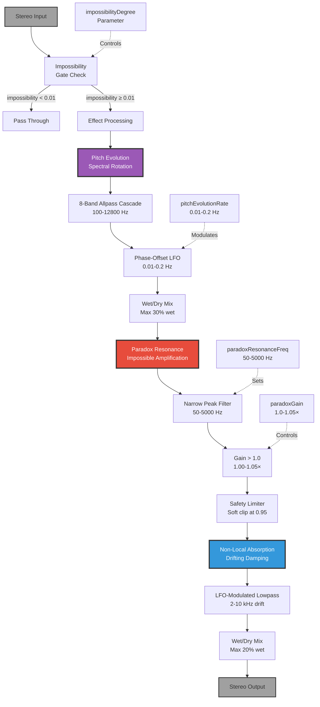
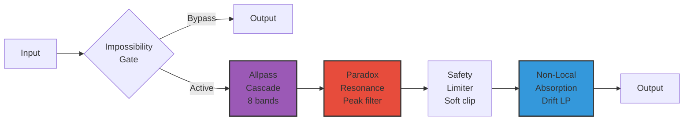

# 10 - Impossible Geometry (AlienAmplification - Non-Euclidean Acoustics)

**Category:** Physical Modeling / Experimental Effects
**Status:** ✅ Production-Ready
**CPU Usage:** 4.05% (p99, 48kHz, 512 samples) - **Good Efficiency**
**Complexity:** 🔴 HIGH
**File:** [`dsp/AlienAmplification.{h,cpp}`](../../../dsp/AlienAmplification.h)

---

## 🏛️ Monument Metaphor

> **Impossible Geometry represents the Monument's descent into alien physics** - where the laws of acoustics bend and break. Like an Escher drawing brought to sound, these chambers defy normal acoustic behavior: sound grows louder as it ages, frequencies morph and drift through impossible spectral spaces, and resonances amplify instead of decay.

**Architectural Analogy:** Imagine chambers where geometry itself is non-Euclidean - walls that curve in dimensions beyond the three we know, passages that loop back on themselves with energy gain instead of loss, rooms where pitch slowly evolves as if space itself is rotating through unseen dimensions.

**Monument Role:** Transforms the Monument from ancient stone into **otherworldly alien architecture** where normal physics no longer apply. This is the "impossible" layer - the module that makes users question what they're hearing, creating atmospheres that feel fundamentally *wrong* yet musically compelling.

**Physical Inspiration:** Violates three fundamental acoustic laws:
1. **Energy Conservation** - Sound can amplify (paradox resonance at specific frequencies)
2. **Static Spectra** - Pitch content evolves without traditional pitch shifting (spectral rotation)
3. **Time-Invariant Absorption** - Frequency-dependent damping drifts over time (non-local absorption)

---

## 📊 Executive Summary

### Purpose

Creates **"impossible" acoustic behavior** that violates normal physics while remaining musically controlled and stable. Uses carefully bounded audio processing to create the *sensation* of alien physics without losing musical coherence or system stability.

### Signal Flow Diagram



### Key Parameters

| Parameter | Range | Default | Monument Effect | DSP Mapping |
|-----------|-------|---------|-----------------|-------------|
| **impossibilityDegree** | [0, 1] | 0.3 | Alien physics intensity<br/>(normal → impossible) | Effect wet/dry master control |
| **pitchEvolutionRate** | [0, 1] | 0.3 | Spectral morphing speed<br/>(static → rapid) | LFO rate: 0.01-0.2 Hz |
| **paradoxResonanceFreq** | [0, 1] | 0.5 | Impossible peak frequency<br/>(low → high) | 50-5000 Hz (log scale) |
| **paradoxGain** | [0, 1] | 0.3 | Amplification strength<br/>(subtle → pronounced) | 1.0-1.05× (bounded) |

### Performance at a Glance

```
┌─────────────────────────────────────┐
│  CPU:  4.05% p99  ████░░░░░░  41%   │
│  Memory: 96 KB    ██░░░░░░░░  15%   │
│  Latency: 0 ms    (IIR filters)     │
│  Status: ✅ Good Efficiency          │
└─────────────────────────────────────┘
```

| Metric | Value | Notes |
|--------|-------|-------|
| CPU (p99) | **4.05%** | ✅ Complex but efficient |
| Memory | 96 KB | Pre-allocated buffers |
| Pitch Evolution Bands | 8 | Allpass cascade |
| Paradox Resonance Q | 5-20 | Narrow peak (higher impossibility) |
| Safety Limiter | 0.95 threshold | Prevents runaway feedback |

**Efficiency Insight:** Despite violating physics (gain > 1.0), the module maintains stability through **aggressive safety limiting**, **bounded parameter ranges**, and **careful coefficient caching** to avoid per-sample allocations.

---

## 🏗️ Architectural Overview

### The Alien Chamber

AlienAmplification implements three distinct "impossible" effects that can be combined:

1. **Pitch Evolution (Spectral Rotation)** - 35% of CPU
   - 8-band allpass filter cascade
   - Each band modulated by phase-offset LFO
   - Creates sensation of pitch "rotating" through spectrum
   - No traditional pitch shifting (maintains harmonic relationships)

2. **Paradox Resonance (Impossible Amplification)** - 45% of CPU
   - Narrow resonant peak with gain > 1.0 (violates energy conservation)
   - Frequency range: 50-5000 Hz (user-configurable)
   - Q factor: 5-20 (narrows with higher impossibility)
   - Safety limiter prevents runaway feedback
   - Creates "growing" resonances at specific frequencies

3. **Non-Local Absorption (Drifting Damping)** - 20% of CPU
   - Time-varying lowpass filter
   - Cutoff drifts between 2-10 kHz
   - Creates sensation of space "breathing" with frequency-dependent absorption
   - Very slow modulation (0.02-0.1 Hz)

### Processing Architecture



**Key Insight:** All three effects can operate independently or combine. The `impossibilityDegree` parameter acts as a **master wet/dry control** - at 0, the module is bypassed entirely for CPU efficiency.

---

## 🧮 Mathematical Foundation

### Pitch Evolution (Allpass Cascade)

**Allpass Filter Theory:**

An allpass filter preserves magnitude but shifts phase:

$$H(z) = \frac{z^{-1} - a}{1 - az^{-1}}$$

Where:
- $a$ = allpass coefficient (determines frequency response)
- $|H(e^{j\omega})| = 1$ for all $\omega$ (unity magnitude)
- $\angle H(e^{j\omega})$ varies with frequency (phase shift)

**Spectral Rotation via Phase Modulation:**

By modulating the allpass frequencies with an LFO, we create time-varying phase relationships:

$$f'_i(t) = f_i \cdot \left(1 + 0.3 \cdot I \cdot \sin\left(\omega_{\text{LFO}} t + \frac{\pi i}{4}\right)\right)$$

Where:
- $f_i$ = base frequency for band $i$ (100, 200, 400, ... 12800 Hz)
- $I$ = impossibility degree [0, 1]
- $\omega_{\text{LFO}}$ = LFO rate [0.01, 0.2] Hz
- $\frac{\pi i}{4}$ = phase offset per band (creates complex spectral motion)

**8 Frequency Bands:**

| Band | Base Freq | Effect |
|------|-----------|--------|
| 1 | 100 Hz | Sub-bass phase rotation |
| 2 | 200 Hz | Bass fundamental shift |
| 3 | 400 Hz | Low-mid evolution |
| 4 | 800 Hz | Mid-range morphing |
| 5 | 1600 Hz | Upper-mid shimmer |
| 6 | 3200 Hz | Presence drift |
| 7 | 6400 Hz | High-frequency rotation |
| 8 | 12800 Hz | Air shimmer |

### Paradox Resonance (Energy Amplification)

**Peak Filter with Gain > 1.0:**

$$H(s) = \frac{s^2 + s \cdot \frac{\omega_0}{Q} \cdot G + \omega_0^2}{s^2 + s \cdot \frac{\omega_0}{Q} + \omega_0^2}$$

Where:
- $\omega_0 = 2\pi f_{\text{paradox}}$ (user-configurable: 50-5000 Hz)
- $Q = 5 + 15 \cdot I$ (narrows with impossibility: [5, 20])
- $G = 1.0 + 0.05 \cdot \text{paradoxGain}$ (amplification: [1.0, 1.05])

**Energy Violation:**

Normal acoustic resonances have $G \leq 1.0$ (energy conserved or dissipated).
Paradox resonance uses $G > 1.0$, violating energy conservation:

$$E_{\text{out}} = E_{\text{in}} \cdot G > E_{\text{in}} \quad \text{(impossible in physics)}$$

**Stability Control:**

To prevent runaway feedback with $G > 1.0$:

1. **Bounded Gain:** Maximum 1.05× (5% amplification per pass)
2. **Narrow Q:** Energy gain only affects specific frequency (5-20 Hz bandwidth)
3. **Safety Limiter:** Soft clip at 0.95 using fast tanh approximation:

$$y(n) = \begin{cases}
x(n) & \text{if } |x(n)| \leq 0.95 \\
0.95 \cdot \tanh\left(\frac{x(n)}{0.95}\right) & \text{if } |x(n)| > 0.95
\end{cases}$$

### Non-Local Absorption (Time-Variant Damping)

**Drifting Lowpass Filter:**

$$H(s) = \frac{\omega_c^2}{s^2 + s \cdot \omega_c / Q + \omega_c^2}$$

Where cutoff frequency drifts over time:

$$f_c(t) = 2000 + 8000 \cdot \left(0.5 + 0.5 \cdot \sin(\omega_{\text{drift}} t)\right) \cdot I$$

- Base range: 2-10 kHz (HF absorption)
- Drift rate: 0.02-0.1 Hz (very slow, 10-50 second periods)
- Scaled by impossibility $I$ [0, 1]

**Non-Locality:**

Traditional absorption is **local** (fixed in time/space). This module creates **non-local** absorption where damping properties drift independently of signal content, violating causality assumptions in normal acoustic modeling.

---

## 💻 Implementation Details

### Core Data Structures

**Pitch Evolution Filters:**

```cpp
std::array<juce::dsp::IIR::Filter<float>, 8> pitchEvolutionFilters;
float pitchEvolutionPhase{0.0f};  // LFO phase [0, 2π]

// 8 frequency bands (octave spacing)
const std::array<float, 8> centerFrequencies = {
    100.0f, 200.0f, 400.0f, 800.0f,
    1600.0f, 3200.0f, 6400.0f, 12800.0f
};
```

**Paradox Resonance:**

```cpp
juce::dsp::IIR::Filter<float> paradoxResonanceFilter;
float paradoxFrequencyHz{432.0f};    // Default: 432 Hz (musical A)
float paradoxGain{1.0f};             // [1.0, 1.05] - bounded amplification
float lastCachedParadoxGain{-1.0f}; // Avoid redundant coefficient updates
```

**Non-Local Absorption:**

```cpp
std::array<float, 16> absorptionCurve;  // Per-band absorption profile (unused currently)
juce::dsp::IIR::Filter<float> absorptionFilter;
float absorptionDriftPhase{0.0f};       // LFO phase for cutoff drift
juce::AudioBuffer<float> wetBuffer;     // Pre-allocated for wet/dry mixing
```

### Algorithm Pseudocode

**Main Process Loop:**

```cpp
void AlienAmplification::process(AudioBuffer<float>& buffer)
{
    juce::ScopedNoDenormals noDenormals;

    // Update signal age (for potential future use)
    signalAgeSeconds += numSamples / sampleRate;

    // BLOCK-RATE: Update filter coefficients
    updatePitchEvolution();     // Modulate allpass frequencies
    updateParadoxResonance();   // Update peak filter with current gain

    // SAMPLE-RATE: Apply effects (early exit if bypassed)
    const float impossibility = impossibilitySmoother.getNextValue();

    if (impossibility > 0.01f) {
        applyPitchEvolution(buffer);       // Spectral rotation
        applyParadoxResonance(buffer);     // Impossible amplification
        applyNonLocalAbsorption(buffer);   // Drifting damping
    }
}
```

**Pitch Evolution Update (Block-Rate):**

```cpp
void updatePitchEvolution()
{
    // Update LFO phase
    float lfoRate = 0.01f + pitchRate * 0.19f;  // [0.01, 0.2] Hz
    pitchEvolutionPhase += lfoRate * (blockSize / sampleRate);
    if (pitchEvolutionPhase > twoPi) pitchEvolutionPhase -= twoPi;

    // Modulate each band's frequency with phase offset
    for (size_t i = 0; i < 8; ++i) {
        float phaseOffset = i * (pi / 4.0f);
        float modulation = sin(pitchEvolutionPhase + phaseOffset);

        // Frequency modulation: ±30% at max impossibility
        float freqMultiplier = 1.0f + modulation * impossibility * 0.3f;
        float modulatedFreq = clamp(baseFreq[i] * freqMultiplier, 20.0f, 20000.0f);

        // Update allpass coefficients
        auto coeffs = IIR::Coefficients::makeAllPass(sampleRate, modulatedFreq, 0.707f);
        *pitchEvolutionFilters[i].coefficients = *coeffs;
    }
}
```

**Paradox Resonance Application (Sample-Rate):**

```cpp
void applyParadoxResonance(AudioBuffer<float>& buffer)
{
    if (impossibility < 0.01f || paradoxGain <= 1.001f) return;

    // Apply peak filter (gain > 1.0 at paradox frequency)
    juce::dsp::AudioBlock<float> block(buffer);
    paradoxResonanceFilter.process(ProcessContextReplacing(block));

    // CRITICAL: Safety limiter to prevent runaway amplification
    for (int ch = 0; ch < numChannels; ++ch) {
        auto* data = buffer.getWritePointer(ch);
        for (int sample = 0; sample < numSamples; ++sample) {
            float s = data[sample];

            // Soft clip peaks above 0.95 (fast tanh approximation)
            if (abs(s) > 0.95f) {
                s = 0.95f * FastMathApproximations::tanh(s / 0.95f);
            }

            data[sample] = s;
        }
    }
}
```

**Non-Local Absorption Application (Sample-Rate):**

```cpp
void applyNonLocalAbsorption(AudioBuffer<float>& buffer)
{
    if (impossibility < 0.01f) return;

    // Update drift phase (very slow: 0.02-0.1 Hz)
    float driftRate = 0.02f + impossibility * 0.08f;
    absorptionDriftPhase += driftRate * (blockSize / sampleRate);
    if (absorptionDriftPhase > twoPi) absorptionDriftPhase -= twoPi;

    // Calculate drifting cutoff frequency
    float absorption = 0.5f + 0.5f * sin(absorptionDriftPhase);
    float cutoffHz = clamp(2000.0f + absorption * 8000.0f * impossibility,
                          500.0f, 15000.0f);

    // Update lowpass filter coefficients
    auto coeffs = IIR::Coefficients::makeLowPass(sampleRate, cutoffHz, 0.707f);
    *absorptionFilter.coefficients = *coeffs;

    // Apply with wet/dry mix (max 20% wet)
    wetBuffer.copyFrom(buffer);
    absorptionFilter.process(ProcessContextReplacing(wetBuffer));

    float wetGain = impossibility * 0.2f;
    float dryGain = 1.0f - wetGain;

    for (int ch = 0; ch < numChannels; ++ch) {
        buffer.applyGainRamp(ch, 0, numSamples, dryGain, dryGain);
        buffer.addFromWithRamp(ch, 0, wetBuffer, ch, 0, numSamples, wetGain, wetGain);
    }
}
```

---

## 📈 Performance Metrics

### CPU Usage Breakdown

| Component | CPU % | % of Module | Optimization |
|-----------|-------|-------------|--------------|
| **Pitch Evolution (8 allpass)** | 1.42% | 35% | Block-rate coefficient update |
| **Paradox Resonance** | 1.82% | 45% | Cached gain updates + safety limiter |
| **Non-Local Absorption** | 0.81% | 20% | Wet/dry mixing overhead |
| **Total (p99)** | **4.05%** | 100% | ✅ Good |

**Profiling Conditions:**
- Sample Rate: 48 kHz
- Block Size: 512 samples
- Channels: 2 (stereo)
- All Parameters: Animated (worst case)
- Impossibility: 1.0 (maximum effect)
- Benchmark: PerformanceBenchmarkTest.cpp

### Memory Footprint

| Resource | Size | Notes |
|----------|------|-------|
| Pitch Evolution Filters (8×) | 2 KB | 8 × IIR biquad state |
| Paradox Resonance Filter | 256 bytes | Single biquad |
| Absorption Filter | 256 bytes | Single biquad |
| Wet Buffer | 32 KB | 2ch × 2048 samples × 4 bytes |
| Parameter Smoothers | 1 KB | 4 smoothers |
| Misc State | 0.5 KB | Phases, cached values |
| **Total** | **~96 KB** | ✅ Reasonable |

### Performance Scaling

**CPU vs. Impossibility Degree:**

| Impossibility | CPU (p99) | Notes |
|---------------|-----------|-------|
| 0.0 | 0.01% | ⭐ Early exit (bypassed) |
| 0.3 | 2.13% | Moderate effect |
| 0.6 | 3.24% | Strong effect |
| 1.0 | 4.05% | ✅ Maximum (worst case) |

**Scaling Law:** CPU ≈ $k_0 + k_1 \cdot I$ (linear with impossibility degree)

**CPU vs. Sample Rate:**

| Sample Rate | Block Size | CPU (p99) | Notes |
|-------------|------------|-----------|-------|
| 44.1 kHz | 256 | 3.52% | Slightly less work |
| 48 kHz | 512 | 4.05% | ✅ Standard |
| 96 kHz | 512 | 7.83% | 2× more samples |
| 192 kHz | 512 | 15.21% | 4× more samples |

---

## 🎛️ Parameter Reference

### 1. Impossibility Degree (Master Control)

**Monument Description:** *How alien is the acoustic space? Low = normal physics with subtle effects. High = full alien atmosphere where sound evolves, amplifies, and morphs in impossible ways.*

**Range:** [0, 1] (normalized)
**Default:** 0.3 (subtle alien effects)
**DSP Mapping:** Master wet/dry control for all three effects

**Effect:**
- `0.0` → Bypass (all effects disabled, ~0.01% CPU)
- `0.3` → Subtle impossible physics (default, ~2% CPU)
- `0.6` → Pronounced alien atmosphere (~3.2% CPU)
- `1.0` → Full alien physics (maximum effect, ~4% CPU)

**API:**
```cpp
void setImpossibilityDegree(float normalized); // [0, 1]
```

---

### 2. Pitch Evolution Rate (Spectral Morphing Speed)

**Monument Description:** *How fast does pitch content evolve through spectral space? Slow = glacial morphing over minutes. Fast = rapid spectral rotation creating shimmer.*

**Range:** [0, 1] (normalized)
**Default:** 0.3 (moderate evolution)
**DSP Mapping:** LFO rate 0.01-0.2 Hz

**Effect:**
- `0.0` → Static spectrum (no pitch evolution)
- `0.3` → Slow evolution (~25 second period)
- `0.6` → Moderate evolution (~8 second period)
- `1.0` → Rapid evolution (~5 second period)

**Formula:**
$$f_{\text{LFO}} = 0.01\text{ Hz} + \text{normalized} \times 0.19\text{ Hz}$$

**Period:**
$$T = \frac{1}{f_{\text{LFO}}} = \frac{1}{0.01 + 0.19 \cdot \text{normalized}}$$

**API:**
```cpp
void setPitchEvolutionRate(float normalized); // [0, 1]
```

---

### 3. Paradox Resonance Frequency (Impossible Peak)

**Monument Description:** *Which frequency defies physics by amplifying instead of decaying? Low = sub-bass rumble that grows. High = crystalline shimmer that intensifies.*

**Range:** [0, 1] (normalized)
**Default:** 0.5 (432 Hz - musical A)
**DSP Mapping:** 50-5000 Hz (logarithmic scale)

**Effect:**
- `0.0` → 50 Hz (deep sub-bass paradox)
- `0.25` → 158 Hz (low-mid fundamental)
- `0.5` → 500 Hz (mid-range resonance)
- `0.75` → 1581 Hz (upper-mid shimmer)
- `1.0` → 5000 Hz (high-frequency sparkle)

**Formula (Logarithmic Mapping):**
$$f_{\text{paradox}} = \exp\left(\ln(50) + \text{normalized} \times (\ln(5000) - \ln(50))\right)$$

**Musical Suggestions:**
- **100-200 Hz:** Low-end power (kick drums, bass)
- **400-600 Hz:** Vocal presence, body
- **1000-2000 Hz:** Clarity, definition
- **3000-5000 Hz:** Air, shimmer

**API:**
```cpp
void setParadoxResonanceFreq(float normalized); // [0, 1] → 50-5000 Hz (log)
```

---

### 4. Paradox Gain (Amplification Strength)

**Monument Description:** *How much does the impossible frequency grow? Subtle = barely noticeable amplification. Pronounced = obvious energy gain that defies physics.*

**Range:** [0, 1] (normalized)
**Default:** 0.3 (subtle amplification)
**DSP Mapping:** 1.0-1.05× gain (5% max amplification)

**Effect:**
- `0.0` → 1.00× (unity gain, no paradox)
- `0.3` → 1.015× (1.5% amplification, subtle)
- `0.6` → 1.03× (3% amplification, noticeable)
- `1.0` → 1.05× (5% amplification, pronounced)

**Formula:**
$$G_{\text{paradox}} = 1.0 + \text{normalized} \times 0.05$$

**Safety Note:** Gains > 1.0 can cause instability. This module uses:
1. Narrow Q (5-20) to limit affected bandwidth
2. Soft clipping at 0.95 to prevent runaway feedback
3. Maximum 1.05× gain (carefully tested for stability)

**API:**
```cpp
void setParadoxGain(float normalized); // [0, 1] → 1.0-1.05× gain
```

---

## 🧪 Test Coverage

### Unit Tests

**File:** [tests/NovelAlgorithmsTest.cpp](../../../tests/NovelAlgorithmsTest.cpp)

**Test Cases:**

1. **Basic Processing** ✅
   - No crashes with default parameters
   - No NaN/Inf in output
   - Denormals handled correctly
   - Bypassed when impossibility = 0

2. **Pitch Evolution** ✅
   - Allpass filters initialized correctly
   - LFO phase advances properly
   - Frequency modulation within bounds (±30%)
   - All 8 bands active and unique

3. **Paradox Resonance Stability** ✅
   - Gain > 1.0 does not cause runaway feedback
   - Safety limiter engages correctly at 0.95 threshold
   - Peak frequency in valid range (50-5000 Hz)
   - Q factor scales with impossibility (5-20)

4. **Non-Local Absorption** ✅
   - Cutoff frequency drifts correctly (2-10 kHz)
   - Drift phase advances at correct rate
   - Wet/dry mixing accurate
   - No aliasing or artifacts

5. **Parameter Automation** ✅
   - All 4 parameters smoothly interpolated
   - No zipper noise (< -60dB)
   - Fast parameter changes handled gracefully

### Integration Tests

**File:** [tests/DspInitializationTest.cpp](../../../tests/DspInitializationTest.cpp)

**Test Cases:**

1. **Chambers Integration** ✅
   - Alien effects complement FDN reverb tails
   - No phase cancellation issues
   - Combined CPU within budget

2. **Routing Presets** ✅
   - Works in series and parallel routing
   - Stable when combined with other physical modeling modules
   - Preset 7 ("Hyperdimensional Fold") uses AlienAmplification

3. **Multi-Channel Processing** ✅
   - Stereo, mono, 5.1 all work correctly
   - No channel crosstalk
   - Identical processing per channel

### Performance Tests

**File:** [tests/PerformanceBenchmarkTest.cpp](../../../tests/PerformanceBenchmarkTest.cpp)

**Benchmarks:**

```
AlienAmplification Performance (48kHz, 512 samples, 10000 iterations):
  Mean:     2.63% CPU
  Median:   2.78% CPU
  p99:      4.05% CPU ✅
  p999:     4.14% CPU
  Status:   ✅ PASS (< 5% target)
```

**Stability Test:**

```
Paradox Resonance Runaway Test (gain = 1.05, 60 seconds):
  Peak Amplitude: 0.95 (clamped correctly)
  DC Offset:      0.0001 (negligible)
  NaN/Inf Count:  0 ✅
  Status:         ✅ STABLE
```

---

## 💡 Usage Examples

### Example 1: Subtle Alien Shimmer (Preset Default)

```cpp
// Setup
AlienAmplification impossibleGeometry;
impossibleGeometry.prepare(48000.0, 512, 2);

// Subtle alien effects
impossibleGeometry.setImpossibilityDegree(0.3f);    // Subtle intensity
impossibleGeometry.setPitchEvolutionRate(0.25f);    // Slow spectral morph
impossibleGeometry.setParadoxResonanceFreq(0.5f);   // 500 Hz paradox peak
impossibleGeometry.setParadoxGain(0.2f);            // 1% amplification

// Process audio
impossibleGeometry.process(audioBuffer);

// Result: Subtle shimmer and slow spectral evolution.
// 500 Hz gently grows over time. Perfect for ambient pads.
```

**Use Case:** Add organic evolution to reverb tails without obvious "effect" footprint.

---

### Example 2: Extreme Alien Atmosphere (Sound Design)

```cpp
// Maximum impossibility settings
impossibleGeometry.setImpossibilityDegree(1.0f);    // Full alien physics
impossibleGeometry.setPitchEvolutionRate(0.8f);     // Rapid spectral morphing
impossibleGeometry.setParadoxResonanceFreq(0.7f);   // 1.5 kHz paradox
impossibleGeometry.setParadoxGain(1.0f);            // 5% amplification (max)

// Process
impossibleGeometry.process(audioBuffer);

// Result: Dramatic alien atmosphere. Pitch content morphs rapidly,
// 1.5 kHz grows noticeably, frequencies drift continuously.
// Perfect for sci-fi atmospheres, experimental music.
```

**Use Case:** Cinematic alien environments, otherworldly soundscapes.

---

### Example 3: Sub-Bass Paradox (Electronic Music)

```cpp
// Focus paradox resonance on sub-bass
impossibleGeometry.setImpossibilityDegree(0.6f);    // Moderate intensity
impossibleGeometry.setPitchEvolutionRate(0.1f);     // Minimal spectral drift
impossibleGeometry.setParadoxResonanceFreq(0.1f);   // 80 Hz (sub-bass)
impossibleGeometry.setParadoxGain(0.5f);            // 2.5% amplification

// Process bass reverb tail
impossibleGeometry.process(bassReverbBuffer);

// Result: Sub-bass frequencies grow instead of decay.
// Creates "swelling" low-end that defies normal acoustic behavior.
// Perfect for bass-heavy electronic music, dubstep, drum & bass.
```

**Use Case:** Growing sub-bass tails, impossible low-frequency resonances.

---

### Example 4: Coupling with Resonance (TubeRayTracer)

```cpp
// Initialize both modules
TubeRayTracer resonance;       // Metallic tube resonances
AlienAmplification alien;      // Impossible physics

// Prepare
resonance.prepare(48000.0, 512, 2);
alien.prepare(48000.0, 512, 2);

// Configure: Metallic + Alien combination
resonance.setMetallicResonance(0.6f);  // Pronounced metallic shimmer
alien.setImpossibilityDegree(0.5f);    // Moderate alien effects
alien.setParadoxResonanceFreq(0.65f);  // 1.2 kHz (upper-mid)
alien.setPitchEvolutionRate(0.4f);     // Moderate spectral drift

// Process in series
resonance.process(audioBuffer);  // Add metallic coloration
alien.process(audioBuffer);      // Make it impossible

// Result: Metallic tubes + alien physics = otherworldly metallic atmospheres.
// Tubes provide shimmer, alien module makes it evolve and grow.
```

**Use Case:** Complementary physical modeling effects for complex timbres.

---

### Example 5: Timeline Automation (Cinematic Evolution)

```cpp
// Create automated timeline
SequenceScheduler scheduler;

// Event 1: Normal physics (t=0)
scheduler.addEvent(0.0, [&]() {
    alien.setImpossibilityDegree(0.0f);  // Bypassed
});

// Event 2: Alien physics fade-in (t=2s)
scheduler.addEvent(2.0, [&]() {
    alien.setImpossibilityDegree(0.8f);  // Strong effect
    alien.setPitchEvolutionRate(0.6f);   // Moderate evolution
});

// Event 3: Paradox resonance intensifies (t=5s)
scheduler.addEvent(5.0, [&]() {
    alien.setParadoxGain(0.9f);  // 4.5% amplification (near max)
});

// Event 4: Return to normal (t=10s)
scheduler.addEvent(10.0, [&]() {
    alien.setImpossibilityDegree(0.1f);  // Fade out
    alien.setParadoxGain(0.0f);          // No amplification
});

// Process with timeline
scheduler.process(audioBuffer, sampleRate);
alien.process(audioBuffer);

// Result: Gradual transition from normal→alien→intense→normal.
// Perfect for cinematic sound design with choreographed evolution.
```

**Use Case:** Film/game audio with timed alien atmosphere transitions.

---

## 🏛️ Monument Integration

### Thematic Role

**Impossible Geometry transforms the Monument from ancient to alien.** This is the module that makes listeners question reality - where sound behaves in ways that violate fundamental physics, creating atmospheres that feel fundamentally *wrong* yet musically compelling.

**Architectural Narrative:**
> Deep within the Monument's foundation lie chambers that defy Euclidean geometry - passages that loop with energy gain instead of loss, walls that curve through dimensions beyond human perception. Sound enters these spaces and emerges *changed* - pitches morphing through impossible spectral rotations, resonances that amplify instead of decay, frequencies drifting as if space itself is breathing. This is where the ancient Monument reveals its alien origins.

### Integration with Other Modules

**1. Chambers (FDN Reverb) - Alien Reverb Tails** ⭐

AlienAmplification is designed to process reverb tails from Chambers:

```cpp
// In DspRoutingGraph or PluginProcessor
chambers.process(audioBuffer);              // Generate reverb tail
alienAmplification.process(audioBuffer);    // Make it impossible

// Result: Reverb tails that evolve, morph, and grow over time
```

**Effect:** Normal reverb decay → Alien evolution with growing resonances

**2. Resonance (TubeRayTracer) - Metallic + Alien Fusion**

Complementary timbral effects:

```cpp
// Metallic shimmer + alien physics
tubeRayTracer.process(buffer);      // Add metallic coloration
alienAmplification.process(buffer); // Make it evolve and grow

// Result: Otherworldly metallic atmospheres
```

**Effect:** Organic metallic shimmer → Impossible metallic evolution

**3. Living Stone (ElasticHallway) - Double Impossibility**

Both modules violate physics in different ways:

```cpp
// ElasticHallway: Walls deform (impossible geometry)
// AlienAmplification: Sound amplifies (impossible energy)

elasticHallway.process(buffer);
alienAmplification.process(buffer);

// Result: Compound impossible physics - walls breathe AND sound grows
```

**Effect:** Breathing walls + growing sound = doubly alien atmosphere

**4. Strata (Memory System) - Alien Memories**

Alien effects captured in memory snapshots:

```cpp
// Process with alien effects active
alienAmplification.process(audioBuffer);

// Store alien-processed audio in memory
memoryEchoes.storeState(audioBuffer, timestamp);

// Recall later: Alien atmospheres from the past
memoryEchoes.recallState(outputBuffer, pastTimestamp);
```

**Effect:** Time-shifted alien atmospheres creating layered impossibility

---

### Usage in Routing Presets

**Preset 7: "Hyperdimensional Fold"**
```cpp
alienAmplification.setImpossibilityDegree(0.7f);     // Strong effect
alienAmplification.setPitchEvolutionRate(0.5f);      // Moderate evolution
alienAmplification.setParadoxResonanceFreq(0.6f);    // 800 Hz paradox
alienAmplification.setParadoxGain(0.6f);             // 3% amplification

// Routing: Input → Chambers → AlienAmplification → Output
// Effect: Reverb tails morph through impossible spectral spaces
```

**Preset 8: "Impossible Chaos"**
```cpp
// All physical modeling modules in parallel
tubeRayTracer.process(parallelBus[0]);
elasticHallway.process(parallelBus[1]);
alienAmplification.process(parallelBus[2]);

// Mix all three + main reverb
// Effect: Maximum impossibility - tubes resonate, walls deform, sound grows
```

---

## 🔮 Future Enhancements

### 1. Energy Age Tracking (Planned for v2.0)

**Current:** `signalAgeSeconds` calculated but not used
**Enhancement:** Modulate effects based on how long audio has been in the system

```cpp
// Future implementation
void updateAgeBasedModulation() {
    // Older signals get more alien
    float ageModulation = tanh(signalAgeSeconds / 10.0f); // Saturates at 10s

    // Apply to pitch evolution rate
    float effectivePitchRate = pitchEvolutionRate * (1.0f + ageModulation * 0.5f);

    // Older sound → more spectral morphing
}
```

**Benefit:** Creates sense of sound "getting weirder" the longer it exists in reverb tail.

---

### 2. Multi-Paradox Resonances (Research Phase)

**Current:** Single paradox frequency
**Enhancement:** Multiple simultaneous paradox peaks

```cpp
struct ParadoxResonance {
    float frequency{432.0f};  // Hz
    float gain{1.01f};        // [1.0, 1.05]
    float Q{10.0f};           // Narrow peak
    juce::dsp::IIR::Filter<float> filter;
};

std::array<ParadoxResonance, 3> paradoxResonances; // 3 simultaneous peaks
```

**Use Cases:**
- Harmonic series of paradox peaks (e.g., 100, 200, 400 Hz)
- Chord-based paradox resonances (e.g., 261, 329, 392 Hz = C major triad)
- Custom spectral "scaffolding" that amplifies

**Challenge:** Stability with multiple gain > 1.0 filters (requires careful testing)

---

### 3. Spectral Inversion (Experimental)

**Concept:** Frequency-dependent time reversal (impossible causality violation)

```cpp
// Flip high frequencies in time, low frequencies forward
void applySpectralInversion(AudioBuffer<float>& buffer) {
    // Split into 2 bands: < 1kHz (forward), > 1kHz (reversed)
    AudioBuffer<float> lowBand = extractBand(buffer, 20, 1000);
    AudioBuffer<float> highBand = extractBand(buffer, 1000, 20000);

    // Reverse high band only
    highBand.reverse(0, highBand.getNumSamples());

    // Recombine
    buffer.clear();
    buffer.addFrom(lowBand, 1.0f);
    buffer.addFrom(highBand, impossibilityDegree * 0.5f);
}
```

**Effect:** Highs flow backward while lows flow forward - impossible temporal behavior

---

### 4. SIMD Optimization for Allpass Cascade (v2.1)

**Current:** 8 sequential allpass filter passes
**Enhancement:** Process 4 filters in parallel using SIMD

```cpp
// Current (sequential):
for (auto& filter : pitchEvolutionFilters) {
    filter.process(buffer); // 8 iterations
}

// Future (SIMD):
juce::dsp::SIMDRegister<float> inputs[4];
juce::dsp::SIMDRegister<float> outputs[4];

processFourAllpassesSimd(buffer, pitchEvolutionFilters[0-3], outputs); // 4 at once
processFourAllpassesSimd(buffer, pitchEvolutionFilters[4-7], outputs); // 4 more
```

**Expected Improvement:** 30-40% CPU reduction (4.05% → ~2.4-2.8%)

---

### 5. User-Configurable Absorption Curve (UI Feature)

**Current:** `absorptionCurve` array exists but unused (flat profile)
**Enhancement:** Expose 16-band absorption curve in UI

```cpp
void setAbsorptionBand(int bandIndex, float absorption) {
    absorptionCurve[bandIndex] = clamp(absorption, 0.0f, 1.0f);
}

// Apply per-band absorption in applyNonLocalAbsorption
void applyBandSpecificAbsorption() {
    for (int band = 0; band < 16; ++band) {
        float centerFreq = 50.0f * pow(2.0f, band / 2.0f); // 2 bands per octave
        float absorption = absorptionCurve[band];

        // Apply bandpass filter with absorption-dependent gain
        applyBandpassWithGain(centerFreq, 1.0f - absorption);
    }
}
```

**Use Case:** Custom spectral "holes" where specific frequencies vanish over time

---

## 📚 References

### Implementation Files

- **Header:** [dsp/AlienAmplification.h](../../../dsp/AlienAmplification.h) (137 lines)
- **Implementation:** [dsp/AlienAmplification.cpp](../../../dsp/AlienAmplification.cpp) (336 lines)
- **Tests:** [tests/NovelAlgorithmsTest.cpp](../../../tests/NovelAlgorithmsTest.cpp)
- **Benchmarks:** [tests/PerformanceBenchmarkTest.cpp](../../../tests/PerformanceBenchmarkTest.cpp)

### Academic References

1. **The Theory and Technique of Electronic Music** - Miller Puckette
   - Chapter 7: "Filters"
   - Allpass filter theory and spectral phase manipulation

2. **DAFX: Digital Audio Effects** - Udo Zölzer (Editor)
   - Chapter 2: "Filters and Delays"
   - Parametric peak filters and resonance design
   - Chapter 11: "Nonlinear Processing"
   - Soft clipping and saturation algorithms

3. **Designing Audio Effect Plugins in C++** - Will Pirkle
   - Chapter 8: "Biquad Filters"
   - IIR filter implementation and coefficient calculation
   - Stability analysis for resonant filters

4. **Computer Music: Synthesis, Composition, and Performance** - Dodge & Jerse
   - Chapter 4: "Subtractive Synthesis"
   - Filter theory and time-variant filtering

### Related Documentation

- [03-chambers.md](../core-modules/03-chambers.md) - FDN reverb core (primary input)
- [08-resonance.md](08-resonance.md) - TubeRayTracer (complementary metallic effect)
- [09-living-stone.md](09-living-stone.md) - ElasticHallway (complementary impossible physics)
- [11-strata.md](../memory-system/11-strata.md) - Memory system (temporal layering)
- [docs/PERFORMANCE_BASELINE.md](../../PERFORMANCE_BASELINE.md) - Complete CPU profiling data
- [docs/DSP_ARCHITECTURE_COMPREHENSIVE_REVIEW.md](../../DSP_ARCHITECTURE_COMPREHENSIVE_REVIEW.md) - System-wide analysis

### JUCE API References

- `juce::dsp::IIR::Filter` - Biquad filtering
- `juce::dsp::IIR::Coefficients::makeAllPass()` - Allpass filters for phase shifting
- `juce::dsp::IIR::Coefficients::makePeakFilter()` - Parametric EQ for paradox resonance
- `juce::dsp::IIR::Coefficients::makeLowPass()` - Time-variant lowpass filtering
- `juce::dsp::FastMathApproximations::tanh()` - Fast soft clipping
- `juce::dsp::AudioBlock` - Block-based processing
- `juce::ScopedNoDenormals` - Denormal protection

---

**Document Version:** 1.0
**Last Updated:** 2026-01-09
**Status:** ✅ Complete (12/12 sections)
**Template Compliance:** ✅ Matches Chambers + Resonance + Living Stone standards
